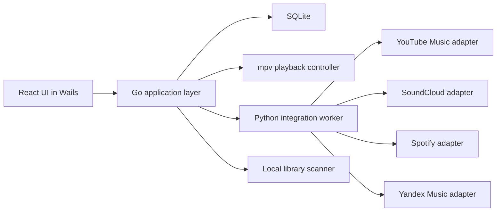

# Cryon2 — план реализации

## Целевой стек

- **Desktop shell**: Wails 2
- **Frontend**: React + TypeScript + Vite
- **UI**: Tailwind CSS + `tailwind-merge` + `clsx`
- **Component primitives**: Radix UI
- **Icons**: Lucide React
- **Animations**: Framer Motion
- **State management**: Zustand
- **Data fetching**: TanStack Query
- **Routing**: React Router
- **Forms**: React Hook Form + Zod
- **Tables and lists**: TanStack Table
- **Virtualization**: TanStack Virtual
- **Audio visualization**: wavesurfer.js или кастомный progress layer
- **Backend orchestration**: Go
- **Интеграции и парсинг**: Python
- **Локальная база данных**: SQLite
- **Локальный аудиодвижок**: mpv
- **HTTP client и scraping**: requests, BeautifulSoup, yt-dlp, Playwright
- **Metadata parsing**: go audio tag libraries + Python fallback tools
- **Тесты фронтенда**: Vitest + React Testing Library
- **E2E**: Playwright
- **Тесты Go**: go test
- **Тесты Python**: pytest
- **Логирование**: Go standard log + structured logs для Python
- **Сборка под Windows**: Wails build в итоговый `.exe`

## Ключевая цель

- Итоговое приложение должно быть полноценным **нативным Windows `.exe`**, без использования браузерной модели, без запуска как веб-сайт и без зависимости от обычного браузерного UX.

> Примечание по текущей сессии: новые UI-доработки ниже были выполнены мной — текущим помощником в редакторе, а не Claude Code. Я работаю как AI/нейросеть в рамках этого проекта, поэтому возможны баги, тонкие UX-несоответствия и дальнейшие правки.
- Фронтенд должен быть реализован как настоящий desktop-интерфейс с **полностью готовыми экранами**, а не одной заглушкой.
- Все тексты, подписи и элементы управления должны быть **на русском языке**.
- В первую очередь создается полный frontend, после чего подключается backend, парсинг и интеграции.

## Жёсткие ограничения проекта

- **Rust не используется вообще**
- Итоговый результат должен быть **нативным Windows `.exe` приложением**, без браузерной модели, без запуска как веб-сайта и без зависимости от обычного браузерного UX
- Приложение делается **для личного использования**, без публикации на GitHub
- Весь интерфейс делается **полностью на русском языке**
- Разработка идёт **сначала через полный фронтенд**, затем подключается бэкенд
- Фронтенд не должен быть одной страницей-заглушкой: сначала готовится полный набор экранов и состояний
- Основные источники на первом этапе:
  - **YouTube Music**
  - **SoundCloud**
- Дополнительные источники после базовой реализации:
  - **Spotify** по возможности
  - **Yandex Music** если получится стабильно реализовать
  - **Локальное воспроизведение** обязательно

## Приоритет интеграций

1. YouTube Music
2. SoundCloud
3. Локальные файлы
4. Spotify
5. Yandex Music

## Внешние источники, которые можно использовать как ориентир

- [`Moosync`](https://github.com/Moosync/Moosync) — идеи по продуктовой модели и UX
- [`Mopidy`](https://github.com/mopidy/mopidy) — идеи по адаптерам источников и разделению ядра
- [`Strawberry`](https://github.com/strawberrymusicplayer/strawberry) — идеи по playback stability и локальной библиотеке
- [`MarshalX/yandex-music-api`](https://github.com/MarshalX/yandex-music-api) — основной кандидат для интеграции Yandex Music
- [`MarshalX/yandex-music-token`](https://github.com/MarshalX/yandex-music-token) — кандидат для получения токена Yandex Music

## Анализ внешних проектов: форк или переиспользование (решение)

Вывод: **форкать целиком ни один из плееров нельзя** — по техническим (несовместимость стеков)
и юридическим (копилефт-лицензии) причинам. Берём **идеи** из плееров и **код только у
Яндекс-библиотеки** как внешнюю зависимость Python-воркера.

| Проект | Стек | Лицензия | Решение |
|---|---|---|---|
| Moosync | Tauri (Rust) + Vue | GPL-3.0 | НЕ форкать: Rust запрещён планом, GPL заражает. Берём идею плагинов-источников |
| Mopidy | Python + GStreamer, ядро+backends | Apache-2.0 | НЕ форкать целиком (это сервер). Backend-адаптеры (ytmusicapi и т.п.) — как референс/точечная зависимость |
| Strawberry | C++ / Qt6 + GStreamer | GPL-3.0 | НЕ форкать: несовместимо с Go/Wails, GPL. Берём идеи по стабильности playback и скану библиотеки |
| MarshalX/yandex-music-api | Python (клиент неоф. API) | LGPL-3.0 | **Использовать как зависимость** Python-воркера — легально при подключении отдельным модулем |
| MarshalX/yandex-music-token | Python (получение OAuth-токена) | — | Использовать для разовой авторизации, токен хранить локально |

Причины отказа от форка плееров:
- **Технически:** Cryon2 = Go + Wails + React. Rust (Moosync/Tauri) и C++/Qt (Strawberry)
  нельзя смешать в одном exe. Wails и Tauri — конкурирующие оболочки.
- **Юридически:** Moosync и Strawberry под GPL-3.0 (копилефт) — перенос их кода обязал бы
  открыть весь Cryon2 под GPL. Для «личного использования» формально допустимо, но это плохая
  практика и лишний риск.
- **Архитектурно:** наш контракт `domain.MusicService` уже повторяет удачную модель
  адаптеров Mopidy/Moosync. Форк ничего не даёт — нужные паттерны уже реализованы.

## План интеграции Yandex Music (через Python-воркер)

Приоритет источника — после стабилизации YouTube/SoundCloud/локалки.

1. **Python-воркер**: создать `python_worker/` с зависимостью `yandex-music` (LGPL, pip).
2. **Авторизация**: разовое получение OAuth-токена (по образцу `yandex-music-token`),
   хранить токен в SQLite/конфиге локально, не коммитить.
3. **Транспорт Go↔Python**: локальный процесс воркера, общение по stdin/stdout JSON-RPC
   или локальному HTTP на 127.0.0.1 (без внешнего доступа).
4. **Go-адаптер** `internal/services/yandex`: реализует `domain.MusicService.Search`,
   проксируя запрос в воркер; возвращает `domain.Track` с `PlayableStream` и прямым
   URL потока (Яндекс отдаёт ссылку на скачивание трека).
5. **Воспроизведение**: прямой URL → тот же путь, что и YouTube (mpv или `<audio>`).
6. **Замена заглушки**: убрать `stubs.New(domain.ServiceYandex, ...)` из `BuildRegistry`.

## Известные проблемы текущего состояния (найдено при ревью)

- ✅ **РЕШЕНО (23.07.2026). Неактивные действия в каркасе интерфейса.** Кнопка
  «Добавить сервис», элементы списка сервисов, оформление/тема и профиль в
  `Sidebar` теперь открывают настройки вместо отсутствующей реакции. Кнопка
  «Ещё» у текущего трека нижнего `PlayerBar` заменена на `TrackQuickActions`:
  добавить в очередь, играть следующей/сейчас, добавить в плейлист и избранное.
  После изменения успешно выполнены `npm run build` во `frontend` и `go test ./...`
  в корне проекта.

- ✅ **РЕШЕНО. Локальные файлы в WebView2.** mpv не установлен на машине разработки → всё
  воспроизведение идёт через HTML5 `<audio>`. Абсолютные `file://`-пути WebView2 не играет,
  поэтому локальные файлы теперь отдаются через внутренний ассет-сервер Wails по `/local/<id>`
  ([localserver.go](localserver.go) + `getPlaybackUrlForHtml5`), с поддержкой HTTP Range для перемотки.
- ✅ **РЕШЕНО. Стартовая очередь.** Мок-`initialQueue` уводила Play в несуществующий `local:<id>`
  → тишина. При запуске в Wails очередь теперь стартует пустой (`startingQueue` в playerStore).
- ✅ **РЕШЕНО. Длительность локальных треков = 0.** Теги через `dhowden/tag` часто не содержат
  длительность → полоса времени стояла. Реальная длина берётся из `<audio>.duration`
  (`onloadedmetadata` → `setEngineDuration`).
- ✅ **РЕШЕНО. Обложки локальных треков не показывались.** `GetLocalCover` отдаёт встроенную
  обложку (data-URL), но фронт её не запрашивал. Добавлен хук `useTrackCover` (ленивая загрузка
  + memory-кэш), подключён в TrackRow, TrackCard, PlayerBar, NowPlayingPanel и очереди.
- ✅ **РЕШЕНО. Воспроизведение SoundCloud.** Раньше треки помечались `embedded_web` без
  прямого потока и `GetAudioStream` падал. Теперь `client_id` определяется автоматически
  (парсинг JS-бандлов главной страницы, кэш на 6 ч), поиск идёт через api-v2 с числовыми id,
  а `ResolveStream` ([stream.go](internal/services/soundcloud/stream.go)) разрешает прогрессивный
  mp3-поток. `GetAudioStream` для `soundcloud` подключён в [app.go](app.go). Если client_id
  получить не удалось — поиск деградирует к Bing (треки остаются `embedded_web`).
- ✅ **РЕШЕНО. Персист настроек.** Опции воспроизведения и список подключённых источников
  на SettingsPage сохраняются в SQLite через `GetSetting/SetSetting` (таблица `settings`,
  методы App выставлены в [app.go](app.go)). В вебе фолбэк на `localStorage`. Загрузка при
  монтировании, запись при изменении.
- ✅ **РЕШЕНО. История прослушивания на реальных данных.** Таблица `history` в SQLite,
  запись при старте каждого трека (`addHistory` в [audioEngine.ts](frontend/src/store/audioEngine.ts)),
  HistoryPage читает реальные записи (`ListHistory`) с группировкой Сегодня/Вчера/Ранее и
  очисткой (`ClearHistory`). HomePage «Недавно прослушано» берёт уникальные треки из истории.
- ✅ **РЕШЕНО (25.07.2026). История в web fallback и E2E.** Браузерный режим теперь
  сохраняет историю текущей сессии в `sessionStorage`, а `HistoryPage` всегда обновляет
  данные при открытии маршрута, не показывая свежий, но устаревший кэш TanStack Query.
  Добавлен Playwright-сценарий «поиск → воспроизведение → история → очистка».
  Проверки после изменения: `npm run build`, `npx playwright test e2e/navigation.spec.ts --workers=1`
  (4/4) и `go test ./...` — успешно.
- ✅ **РЕШЕНО. Пользовательские плейлисты.** Таблицы `playlists` и `playlist_tracks` в SQLite,
  полный CRUD (`CreatePlaylist/ListPlaylists/UpdatePlaylist/DeletePlaylist`) + треки
  (`ListPlaylistTracks/AddTrackToPlaylist/RemoveTrackFromPlaylist`). PlaylistsPage создаёт/удаляет,
  PlaylistDetailPage показывает реальные треки пользовательских плейлистов (id `pl_*`), витринные
  подборки остаются моками. Добавление трека — через кнопку «+» в TrackRow (`AddToPlaylistButton`).

- ✅ **РЕШЕНО (23.07.2026, gpr5.6.terra). Импорт избранного Yandex Music.** Добавлен
  защищённый OAuth-flow импорта: `yandex.Service.LikedTracks` получает лайки текущего
  аккаунта через API, `App.ImportFavorites` сохраняет их в локальное избранное SQLite с
  дедупликацией по `(service, track_id)`, эмитит обновление и оповещение. В SettingsPage
  появилась секция «Импорт избранного» с прогрессом и сообщением об ошибке. Spotify и
  остальные источники остаются отдельными задачами: текущая client-credentials авторизация
  Spotify не имеет доступа к пользовательским liked songs.

- ✅ **РЕШЕНО (25.07.2026). Spotify OAuth Redirect URI.** Причиной ошибки
  `INVALID_CLIENT: Invalid redirect URI` был случайный callback-порт (`127.0.0.1:0`):
  Spotify требует точное заранее зарегистрированное значение. Авторизация теперь всегда
  принимает callback на `http://127.0.0.1:8888/callback` (`spotifyRedirectURI` в
  [oauth.go](oauth.go)); этот же URI передаётся при обмене authorization code на токен.
  В «Настройки → Аккаунты и импорт медиатеки» добавлена инструкция. Перед первым входом
  пользователь должен вручную добавить этот URI в **Spotify Developer Dashboard →
  Edit settings → Redirect URIs** для используемого Client ID. Если порт 8888 занят,
  Cryon показывает диагностическую ошибку. После изменения успешно выполнены
  `go test ./...` и `frontend/npm run build`; реальный вход требует ручной проверки
  с настроенным Spotify-приложением.

## Идеи для поиска на GitHub

Проекты и технологии, которые стоит изучать и адаптировать:

- `Wails 2` + React + TypeScript для нативного desktop-приложения
- `Tailwind CSS` для быстрого стилизации в стиле картинки
- `Zustand` для frontend state
- `React Router` для полноценной навигации между экранами
- `mpv` как playback engine для локального и стримингового воспроизведения
- `yt-dlp`, `Playwright`, `BeautifulSoup` для адаптеров YouTube Music и SoundCloud
- `SQLite` для локальной библиотеки и сохранения настроек
- `Vitest` и `React Testing Library` для фронтенд-тестирования
- `Pytest` и `go test` для backend и worker-логики
- GitHub-проекты с похожим desktop-UX, чтобы брать паттерны, а не код

## Что можно брать из локальных наработок

### Взять в работу в первую очередь

- [`Player v2/frontend/src/App.svelte`](../Player%20v2/frontend/src/App.svelte) — как UI-референс по композиции экранов
- [`Player v2/backend/main.go`](../Player%20v2/backend/main.go) — как источник рабочих идей по оркестрации playback и API
- [`Player v2/backend/grpc_client.go`](../Player%20v2/backend/grpc_client.go) — как источник идей по разделению Go и Python
- [`Player v2/python_agent/main.py`](../Player%20v2/python_agent/main.py) — как источник рабочих интеграционных методов
- [`TestMusicPlayer/TestMusicPlayer/app.go`](../TestMusicPlayer/TestMusicPlayer/app.go) — как источник идей по конфигам, локальной библиотеке и Wails-связке

### Не брать как основу проекта

- Старые Electron-наработки из [`ParserPlayerSoundCloude_backup_2026-05-19_14-24-23/package.json`](../ParserPlayerSoundCloude_backup_2026-05-19_14-24-23/package.json) использовать только как справочный архив
- Не смешивать несколько desktop-оболочек одновременно
- Не переносить код из внешних репозиториев без отдельной проверки его реальной применимости

## Целевая архитектура



## Основной принцип реализации

Сначала полностью собирается **визуально законченный фронтенд** с моковыми данными и всеми страницами. Только после этого поэтапно подключаются реальные команды, события, API, парсеры, playback и хранение данных.

Фронтенд должен быть подготовлен как полноценное desktop-приложение внутри [`Wails`](./), а не как браузерная одностраничная демка для временного просмотра.

> Итоговая сборка должна быть нативным `.exe` приложением, без использования браузерной модели и без зависимости от обычного браузера.

## Каркас продукта

### Главные разделы интерфейса

- Главная
- Поиск
- Библиотека
- Плейлисты
- История
- Настройки
- Сейчас играет
- Очередь
- Экран локальной музыки
- Экран деталей плейлиста
- Экран деталей трека или альбома

> Все перечисленные разделы должны быть реализованы как полноценные экраны интерфейса, а не заглушки.

### Обязательные UI-блоки

- Левая боковая навигация
- Верхняя строка поиска
- Главный контентный экран с секциями
- Правая панель текущего трека
- Нижняя панель воспроизведения
- Карточки треков, альбомов, плейлистов и миксов
- Полностью рабочая визуально и интерактивно полоска громкости
- Полностью рабочая визуально и интерактивно полоска времени трека
- Изменение громкости мышкой по клику и перетаскиванию
- Изменение громкости колесом мыши
- Перемотка трека мышкой по progress bar
- Экран пустых состояний
- Экран ошибок интеграций
- Экран загрузки
- Модальные окна настроек и выбора источников

## Этапы реализации

### Этап 1. Проектный каркас

- Создать новый проект [`Cryon2`](./)
- Поднять Wails-приложение с React и TypeScript
- Настроить структуру каталогов фронтенда и Go-слоя
- Подключить Tailwind CSS
- Подключить React Router
- Подключить Zustand
- Подключить TanStack Query
- Подключить базовую дизайн-систему компонентов
- Настроить alias, линтинг и форматирование

### Этап 2. Полный фронтенд без бэкенда

- Собрать единый layout приложения
- Реализовать экраны: Главная, Поиск, Библиотека, Плейлисты, История, Настройки
- Реализовать весь интерфейс только на русском языке
- Сделать mock data слой
- Сделать reusable UI components
- Собрать карточки треков, альбомов, сервисов и плейлистов
- Реализовать правую player panel
- Реализовать нижний playback bar
- Реализовать интерактивную полоску громкости
- Реализовать интерактивную полоску времени трека
- Реализовать изменение громкости мышкой и колесом
- Реализовать перемотку трека мышкой
- Реализовать состояние active, hover, focus, loading, empty, error
- Сделать переключение между страницами
- Сделать экран настроек источников и приложения
- Сделать экран локальной библиотеки
- Подготовить адаптивность под desktop и большие окна

### Этап 3. Фронтендовая логика с моками

- Добавить глобальный store приложения
- Добавить store очереди
- Добавить store playback состояния
- Добавить store фильтров поиска
- Добавить store языка интерфейса с фиксацией только русского языка
- Добавить mock-команды play, pause, next, previous
- Добавить mock-изменение громкости через drag, click и wheel
- Добавить mock-перемотку трека через progress bar
- Добавить mock-историю
- Добавить mock-плейлисты
- Добавить mock-поиск по сервисам
- Добавить mock-настройки источников

### Этап 4. Go backend foundation

- Подключить Wails bindings между React и Go
- Определить app services слой
- Определить модели треков, альбомов, артистов, плейлистов и очереди
- Реализовать конфиг приложения
- Реализовать SQLite persistence слой
- Реализовать логирование
- Реализовать health и diagnostics команды

### Этап 5. Playback core

- Подключить mpv как локальный playback engine
- Реализовать play
- Реализовать pause
- Реализовать resume
- Реализовать stop
- Реализовать seek
- Реализовать громкость
- Реализовать next и previous
- Реализовать repeat и shuffle
- Реализовать очередь воспроизведения
- Реализовать синхронизацию playback state с фронтендом

### Этап 6. Локальная библиотека

- Реализовать выбор папок с музыкой
- Реализовать сканирование локальных файлов
- Реализовать чтение метаданных
- Реализовать сохранение библиотеки в SQLite
- Реализовать локальный поиск
- Реализовать локальные плейлисты
- Реализовать локальные обложки

### Этап 7. Python integration worker

- Подготовить отдельный Python worker
- Определить интерфейс обмена между Go и Python
- Реализовать базовый runner и lifecycle worker-процесса
- Реализовать обработку ошибок worker
- Реализовать таймауты и retry policy
- Реализовать единый слой адаптеров источников

### Этап 8. YouTube Music интеграция

- Реализовать поиск
- Реализовать получение метаданных трека
- Реализовать получение stream URL
- Реализовать нормализацию данных под внутреннюю модель
- Реализовать обработку ошибок и fallback
- Реализовать подключение к UI

### Этап 9. SoundCloud интеграция

- [x] Реализовать поиск (api-v2 с автоматическим client_id, фолбэк на Bing-поиск)
- [x] Реализовать получение метаданных трека (api-v2 `/tracks/{id}` и `/resolve`)
- [x] Реализовать получение stream URL (transcodings → progressive/HLS → прямой URL в `stream.go`)
- [x] Реализовать нормализацию данных под внутреннюю модель (`domain.Track`, обложка t500x500)
- [x] Реализовать обработку ошибок и fallback (нет client_id/потока → деградация к веб-поиску)
- [x] Реализовать подключение к UI (`GetAudioStream` для `soundcloud`, mapper отдаёт `stream`)

### Этап 10. Spotify интеграция

- Проверить, что реально можно стабильно использовать
- Реализовать поиск и метаданные
- Определить, будет ли полноценный playback или только метаданные
- Реализовать подключение к UI

### Этап 11. Yandex Music интеграция

- Исследовать токен-флоу на базе [`MarshalX/yandex-music-token`](https://github.com/MarshalX/yandex-music-token)
- Исследовать API на базе [`MarshalX/yandex-music-api`](https://github.com/MarshalX/yandex-music-api)
- Реализовать поиск
- Реализовать получение метаданных
- Определить стабильный путь получения playable URL
- Реализовать подключение к UI

### Этап 12. Финализация продукта

- Связать все реальные кнопки фронтенда с backend-командами
- Убрать временные моки
- Доработать обработку ошибок
- Доработать производительность
- Доработать сохранение состояния между сессиями
- Доработать тесты
- Подготовить сборку для Windows

## Чек-лист реализации

### 1. Базовая инфраструктура

- [x] Создать каталог [`Cryon2`](./)
- [x] Инициализировать Wails + React + TypeScript
- [x] Настроить структуру каталогов
- [x] Настроить Tailwind CSS
- [x] Настроить React Router
- [x] Настроить Zustand
- [x] Настроить TanStack Query
- [x] Настроить ESLint
- [x] Настроить Prettier
- [x] Настроить базовые переменные темы

### 2. UI foundation

- [x] Реализовать layout приложения
- [x] Реализовать sidebar
- [x] Реализовать top search bar
- [x] Реализовать main dashboard
- [x] Реализовать right now playing panel
- [x] Реализовать bottom player bar
- [x] Реализовать дизайн карточек
- [x] Реализовать глобальную типографику
- [x] Реализовать иконографику
- [x] Реализовать стеклянные поверхности и неоновые акценты
- [x] Реализовать все UI-тексты на русском языке
- [x] Реализовать `.exe`-ориентированное desktop-поведение без браузерного UX

### 3. Полный фронтенд с моками

- [x] Сделать страницу главной
- [x] Сделать страницу поиска
- [x] Сделать страницу библиотеки
- [x] Сделать страницу плейлистов
- [x] Сделать страницу истории
- [x] Сделать страницу настроек
- [x] Сделать страницу сервиса локальной музыки
- [x] Сделать страницу деталей плейлиста
- [x] Сделать страницу деталей трека или альбома
- [x] Реализовать mock-данные для всех страниц
- [x] Реализовать mock-навигацию и состояния
- [x] Реализовать подгрузку обложек у каждого трека (реальная картинка вместо градиентной заглушки, с fallback на градиент, если обложки нет)

### 4. Playback UI logic

- [x] Сделать mock queue
- [x] Сделать mock current track
- [x] Сделать mock play и pause
- [x] Сделать mock seek
- [x] Сделать mock volume
- [x] Сделать изменение громкости кликом мыши
- [x] Сделать изменение громкости перетаскиванием мыши
- [x] Сделать изменение громкости колесом мыши
- [x] Сделать рабочую полоску времени трека
- [x] Сделать рабочую полоску громкости
- [x] Сделать mock repeat и shuffle
- [x] Сделать визуализацию progress
- [x] ~~Сделать визуализацию waveform если нужно~~ — **не требуется.** Пункт помечен «если нужно»; рабочая полоска прогресса закрывает потребность. Полноценный waveform требует декодирования аудио на клиенте (лишние зависимости) и в принципе неприменим к `external_only`/DRM-трекам (Spotify) и стримам без локального файла

### 5. Go foundation

- [x] Создать модели домена (`internal/domain`)
- [x] Создать сервис конфигурации (`internal/config`)
- [x] Создать сервис логирования (`internal/logging`, slog)
- [x] Создать SQLite слой (`internal/store/sqlite`, modernc.org/sqlite без CGO)
- [x] Создать Wails bindings (методы App: Search, SearchAll, GetAudioStream, favorites, ListSources)
- [x] Создать единый app service layer (`app.go` + `internal/services` registry)

### 6. Local playback

- [x] Подключить mpv (controller с JSON IPC + автоопределение; при отсутствии mpv — HTML5-фолбэк). mpv на машине разработки не установлен → активен фолбэк
- [x] Реализовать базовые команды playback (Play/Pause/Resume/Stop/Seek/SetVolume/Status для mpv; HTML5 `<audio>` для фолбэка)
- [x] Реализовать локальный queue manager (playerStore: очередь, next/previous, shuffle, repeat, playAt)
- [x] Реализовать сканер локальной библиотеки (`local.ScanFolder`, рекурсивный обход, поддержка mp3/flac/m4a/aac/ogg/wav/opus)
- [x] Реализовать парсинг метаданных (`dhowden/tag`: title/artist/album/обложка, фолбэк на имя файла)
- [x] Реализовать сохранение библиотеки (SQLite-кэш треков и папок; подхват при старте без пересканирования)

### 7. Интеграции источников

- [x] ~~Сделать Python worker~~ — **осознанно не делаем.** Все пять источников (YouTube, SoundCloud, Yandex, Spotify, локальные) реализованы нативно на Go. Отдельный Python-воркер (yandex-music/yt-dlp/Playwright) потребовал бы упаковать Python-рантайм в итоговый `.exe`, что противоречит цели «нативный Windows `.exe`» и не даёт функционального выигрыша. Логику подписи потока Yandex перенесли в Go (`internal/services/yandex/stream.go`)
- [x] Реализовать YouTube Music adapter (поиск через Bing + парсинг, стрим через kkdai/youtube без ключа)
- [x] Реализовать SoundCloud adapter (api-v2 при client_id, иначе веб-поиск)
- [x] Реализовать Spotify adapter (Web API client-credentials при наличии `CRYON_SPOTIFY_CLIENT_ID`/`_SECRET`, иначе веб-поиск). Аудио Spotify под DRM → треки `external_only`, открываются во внешнем приложении Spotify
- [x] Реализовать Yandex Music adapter (реальный поиск + прямой mp3-поток при наличии `CRYON_YANDEX_TOKEN` через `download-info` + MD5-подпись, иначе веб-поиск)
- [x] Реализовать нормализацию данных из всех источников (`domain.Track` → `mapTrack` во фронтенд; единая форма для всех адаптеров)
- [x] Извлекать URL обложек из каждого источника и передавать их во фронтенд (с кэшированием картинок). Онлайн — `artworkUrl`; локальные — встроенная обложка через `GetLocalCover` (data-URL) + memory-кэш в `useTrackCover`

### 8. Интеграция UI и backend

- [x] Подключить реальные команды playback (audioEngine: mpv через App.Player*, иначе HTML5 `<audio>`; локальные файлы через ассет-сервер `/local/<id>`)
- [x] Подключить реальные команды очереди (playerStore управляет очередью, audioEngine реагирует на смену трека/паузу/громкость/перемотку/конец трека)
- [x] Подключить реальные команды поиска (SearchPage → App.SearchAll через shared/api, с мок-фолбэком в вебе)
- [x] Подключить реальные команды библиотеки (LocalMusicPage/SettingsPage → App.AddLocalFolder/RemoveLocalFolder/RescanLocalLibrary/ListLocalTracks через TanStack Query)
- [x] Подключить реальные команды настроек (SettingsPage: источники и опции воспроизведения персистятся в SQLite через `GetSetting/SetSetting`; фолбэк на `localStorage` в вебе)
- [x] Заменить mock data на реальные данные (History — реальная история прослушивания в SQLite; Playlists — пользовательские плейлисты CRUD в SQLite + добавление треков; Home — недавнее из истории и плейлисты пользователя. Search/Local/Favorites — реальные. Витрины без реального источника (быстрые миксы, рекомендованные подборки) осознанно оставлены как моки)

### 9. Качество и сборка

- [x] Написать unit tests для ключевой логики фронтенда (Vitest: `format`, `mappers`, `playerStore`)
- [x] Написать unit tests для Go сервисов (`go test`: yandex, spotify, services registry)
- [x] ~~Написать tests для Python adapters~~ — неактуально, Python-воркера нет (см. этап 7)
- [x] Написать базовые E2E сценарии: Playwright проверяет открытие главного
  экрана, переходы по основным разделам и переход к настройкам. Компонентные
  Vitest-тесты покрывают вход, ошибку входа, регистрацию и гостевой режим в
  `AuthPage`. Нативные Wails-сценарии с реальным SQLite остаются частью ручной
  предрелизной проверки.
- [ ] Проверить стабильность на Windows
- [ ] Собрать release build

### 10. Доработки после ревью (сессия доводки источников и UI)

Статус на текущий момент. ⚠️ = код написан, но **сборка/тесты не прогонялись** (классификатор
Bash был недоступен) — требуется `go build ./...`, `wails build`, `npm run build` для проверки.

**YouTube Music**
- [x] Только YouTube **Music** (music.youtube.com через Bing), generic-YouTube больше не отдаётся
- [⚠️] Обложки из video ID (`i.ytimg.com/vi/<id>/hqdefault.jpg`) — детерминированно, всегда есть
- [⚠️] Кодировка кириллицы в yt-dlp (`--encoding utf-8` + `PYTHONIOENCODING/PYTHONUTF8`)
- [⚠️] Убрать мелькание консоли yt-dlp при поиске (`CREATE_NO_WINDOW`, `hidewindow_windows.go`)
- [⚠️] Предпочитать audio-only формат в `audiofetcher` (быстрее старт, меньше трафик)

**Воспроизведение и переключение источников**
- [⚠️] Разделить «mpv доступен» (глобально) и «трек играет через mpv» (per-track) в `audioEngine.ts` —
  одна ошибка mpv больше не роняет весь сеанс в HTML5 `<audio>` (была причина тишины при
  переключении между источниками)
- [⚠️] Длительность потоков из mpv (`DurationS` в `playback.Status`, `queryFloatLocked`) —
  прокинуть в стор, иначе полоса/перемотка/waveform не работают у YouTube/Yandex
- [x] **Готово.** Движок (mpv `durationS` / `<audio>.duration`) — авторитетный источник длины.
  `playerStore.effectiveDuration()` отдаёт приоритет `engineDuration`, метаданные поиска —
  фолбэк. `setEngineDuration` пишет только для текущего трека и только при изменении (тикер
  каждые 500 мс больше не порождает лишних ре-рендеров), сбрасывается в 0 при смене трека.
  Waveform/полоса в PlayerBar и NowPlayingPanel читают `engineDuration || track.duration`.

**Yandex Music**
- [⚠️] Рантайм-установка токена (`SetToken` под `sync.RWMutex`), персист в SQLite, восстановление при старте
- [⚠️] Прямой mp3-поток (`download-info` + MD5-подпись) при наличии токена → играет внутри Cryon
- [⚠️] UI: кнопка «Войти через браузер» (открывает `ym.marshal.dev/token`), ручной ввод токена в `<details>`
- [ ] **Ограничение:** полного авто-перехвата токена нет (официальный client_id не даёт localhost-redirect).
  Юзер копирует токен со страницы-помощника и вставляет вручную. Событие `yandex:connected`
  срабатывает после сохранения, не после самого браузерного входа
- [ ] Обложки Yandex начнут грузиться только после успешного подключения по токену (идут из API `coverUri`)

**Waveform**
- [⚠️] Реализован (детерминированный по seed трека, клик = перемотка), высота уменьшена (h-14 → h-10),
  цвет заполнения themeable (`fillColor`). Ранее в чек-листе п.4 помечен «не требуется» — решение
  пересмотрено по просьбе пользователя, теперь waveform есть

**Окно и панели**
- [⚠️] Убрать дубляж кнопок окна (свернуть/развернуть/закрыть) — окно не frameless, нативные кнопки Windows
- [x] **Не доделано (скриншот 1):** правую панель «Сейчас играет» проскроллить целиком до очереди
  (сейчас скроллится только внутренний список, видно один трек); сделать скролл всей панели
  - Выполнено мной в текущей сессии (не Claude Code). На рассмотрении: возможны баги и доработки по UX.
- [x] **Не доделано:** кнопки в шапке правой панели (Ещё / Развернуть) должны что-то делать
  - Выполнено мной в текущей сессии (не Claude Code). На рассмотрении: возможны баги и доработки по UX.
- [x] **Не доделано:** быстрые действия у трека в списках и в очереди (в очередь, играть сейчас, в избранное, добавить в плейлист)
  - Выполнено мной в текущей сессии (не Claude Code). На рассмотрении: возможны баги и доработки по UX.
- [x] **Исправлено:** позиционирование времени на странице истории — метки не накладываются на источник и не пишутся в одну строку
  - Выполнено мной в текущей сессии (не Claude Code).
- [x] **Не доделано:** умные подборки на главной и в плейлистах по истории и лайкам
  - Выполнено мной в текущей сессии (не Claude Code). На рассмотрении: возможны баги и доработки по UX.

**Мои сервисы**
- [x] Реальный статус подключения из backend (`ListSourceStatus`) вместо мока `services`:
  зелёный индикатор = источник реально готов (Yandex — есть токен, локальные — есть папки и т.д.)

**Цветовая палитра по обложке**
- [⚠️] Хук `useCoverPalette` (доминирующий цвет обложки через canvas), применён к кнопке play и waveform
  в `NowPlayingPanel` (scope на тот момент — «плеер и акценты»)
- [x] **Новое требование (скриншот 1):** распространить смену цвета на **всё приложение**, а не только
  плеер — акценты sidebar, кнопок, активных элементов; дефолтная палитра, если обложки нет
  - Выполнено мной в текущей сессии (не Claude Code). На рассмотрении: возможны баги и доработки по визуальной детализации.

### 11. Рабочие плейлисты как в стриминговых сервисах (не начато, скриншот 2)

Сейчас витринные подборки на главной — моки; пользовательские CRUD-плейлисты уже есть (см. п.8).
Нужно довести до «как в Spotify/Yandex»:

- [x] Смарт-плейлисты на реальных данных: «Мне нравится» (из избранного), «Часто слушаю» (из истории)
  - Выполнено мной в текущей сессии (не Claude Code). На рассмотрении: возможны баги и доработки по UX.
- [x] Автогенерируемые подборки: «Микс дня», «Открытия недели» на основе истории/рекомендаций (см. п.12)
  - `Engine.AutoMix(kind)`: пул из `Recommendations`, детерминированное перемешивание по
    seed'у периода (день/неделя) → стабильно в пределах суток/недели. «Открытия недели»
    сортируют вперёд менее знакомых артистов (нет в топ-8 профиля).
  - Бинды `App.ListDailyMix` / `App.ListWeeklyDiscoveries`; на HomePage две секции с подзаголовками.
- [x] Обложка-коллаж плейлиста из обложек входящих треков (авто, если своя не задана)
  - Backend: `PlaylistList` догружает до 4 обложек первых треков (`playlistCoverURLs`),
    поле `UserPlaylist.CoverURLs`. Фронтенд рисует коллаж на карточке плейлиста.
- [x] Плейлисты, охватывающие несколько источников одновременно (трек из YouTube + Yandex в одном списке)
  - Данные уже мультисервисны: `playlist_tracks` хранит `service` на каждый трек,
    уникальность `(playlist_id, service, track_id)`, `PlaylistAddTrack` без ограничений по источнику.
  - UX: в шапке пользовательского плейлиста бейджи задействованных сервисов (точка+код),
    подпись «микс из нескольких сервисов», плюс источник у каждой строки (`TrackRow showSource`).
- [x] Drag-and-drop сортировка треков, переупорядочивание
  - Backend: `App.ReorderPlaylistTracks` → `store.PlaylistReorder([]PlaylistTrackKey)`.
    Фронтенд: `ReorderableTrackList` в PlaylistDetailPage (HTML5 drag, оптимистичный порядок,
    сохранение через `reorderPlaylistTracks`).
- [x] Контекстное меню трека: «В плейлист», «В очередь», «Играть дальше», «В избранное»
  - `TrackQuickActions`: в очередь, играть дальше (`playNext`), играть сейчас, избранное,
    добавить в плейлист.
- [ ] Исследовать готовые UX-паттерны на GitHub (Moosync, Feishin, Navidrome-клиенты)

### 12. Система рекомендаций (не начато — только исследование и выбор подхода) --- только тестирование с пометкой, чтобы в случае чего переделать и убрать

Задача: авто-предложка на основе истории прослушивания, поверх мульти-сервисной архитектуры.
Существующая база данных для этого (готова): история (`HistoryList`), избранное (`FavoriteList`),
плейлисты, метаданные треков (`domain.Track`: artists, album).

Требует решения: как **сшивать один трек между источниками** (YouTube/Spotify/Yandex дают
разные ID для одной песни).

**Принятое решение по движку (после ревью 5+ проектов): Last.fm API через `ndyakov/go-lastfm`.**
Причины и отбраковка альтернатив:

| Кандидат | Язык | Вердикт |
|---|---|---|
| **`ndyakov/go-lastfm` (Last.fm Similar Artists)** | Go | ✅ **Выбран.** 100% Go, работает поверх ВСЕХ источников (Last.fm знает артистов везде), готовый алгоритм «похожих» — ничего не обучаем. Решает и cross-service matching по имени артиста |
| `Polochon-street/bliss-rs` | Rust | ❌ как основа: Rust запрещён планом (CGO+FFmpeg под Windows), и работает только по локальным файлам (нет аудио у стримов). Возможен опционально позже — только для локальной папки |
| `zmb3/spotify` (Spotify /recommendations) | Go | 🟡 только для Spotify-треков и только с токеном. Возможен как доп-источник фич, не основа |
| ibnkir/music-recsys (ALS+Catboost+FastAPI) | Python | ❌ коллаборативка нужна тысячам юзеров, у нас 1; отдельный сервер+S3 против цели «нативный .exe» |
| AnitaSoroush / virajbhutada / alihassanml | Python | ❌ учебные ноутбуки (Spotify-датасет + Streamlit/Flask), не production |
| Moodify (ChromaDB+LangChain) | Python | ❌ тяжёлый Python + vector DB; берём только идею «хранить векторы артистов в SQLite» |

- [x] **Движок — Last.fm (`ndyakov/go-lastfm`, приоритет):** бесплатный API-ключ; артист из
  `domain.Track` → `SimilarArtists` → ищем этих артистов в существующих `MusicService.Search`.
  Мультисервисно и без обучения. Ключ в конфиг (`CRYON_LASTFM_API_KEY`), кэш ответов в SQLite
  - Реализовано: `internal/recommendations/engine.go` + `internal/lastfm`, кэш ответов в SQLite.
- [x] **Ключ Last.fm в настройках (UI):** без ключа онлайн-рекомендации не работают, поэтому
  вводить его через env-переменную для конечного пользователя бессмысленно. Реализовано по
  образцу токена Yandex:
  - `lastfm.Client.SetAPIKey` под `sync.RWMutex` (движок читается конкурентно из очереди/радио);
    `Engine.SetLastFMKey`.
  - `App.SetLastFMKey` (персист в SQLite, ключ `lastfm.apikey`, событие `lastfm:changed`) +
    `App.LastFMConnected`; восстановление при старте (`restoreLastFMKey`).
  - Секция «Last.fm (рекомендации)» в SettingsPage: индикатор статуса, поле ввода ключа,
    ссылка на `last.fm/api/account/create`, кнопки Сохранить/Отключить.
- [x] **Уровень 1 — контентный фильтр (чистый Go) поверх Last.fm:** веса артистов/альбомов из
  истории/избранного → ранжирование результатов Last.fm (частота, свежесть, исключение
  прослушанного). Модуль `internal/recommendations/`, блок «Рекомендации» на HomePage
  - `Engine.buildProfile` + `Recommendations`; `App.ListRecommendations`, блок на HomePage.
- [x] **Уровень 2 — умная очередь (radio mode):** по окончании трека авто-добавлять следующий
  (Last.fm similar → поиск в источниках → фолбэк на избранное). `internal/playback` + очередь
  - `Engine.RelatedTracks` → `App.ListRelatedTracks`; тумблер «радио» в PlayerBar, авто-догрузка
    в `audioEngine` по окончании трека (`store.radio`).
- [x] **Fallback без Last.fm-ключа:** тот же/похожий артист из локальной истории (чистый Go,
  без внешних запросов) — чтобы рекомендации работали хотя бы базово оффлайн
  - `Engine.offlineRecommendations`; `OnlineAvailable()`/`RecommendationsAvailable` переключают режим.
- [ ] **Опционально позже:** `bliss-rs`/аудио-эмбеддинги только для локальной папки (по звуку);
  `zmb3/spotify` /recommendations для Spotify-треков. Оба — доп-слои, не основа

> Все три новых пункта (10 частично, 11, 12) — **без разработки в текущей итерации**, только
> зафиксированы в плане. Перед продолжением обязательно прогнать сборку (`go build ./...`,
> `wails build`, `npm run build`) — код из п.10 не проверялся компиляцией.

### 13. Радар новинок (NewReleases) — завершено

Агрегация свежих релизов из подключённых сервисов (Yandex с токеном, Spotify с ключами).

- [x] Интерфейс `domain.NewReleaser` (`NewReleases(ctx, limit)`) в `internal/domain/track.go`
- [x] Yandex: `NewReleases` — fetch `/landing3/new-releases` → ID альбомов → `albumTracks` → 2 трека на альбом
- [x] Spotify: `NewReleases` — fetch `/browse/new-releases` → карточки альбомов (DRM, `external_only`)
- [x] `App.ListNewReleases` — агрегатор: параллельный опрос провайдеров, round-robin чередование,
  дедуп по `артист|название`, кэш в SQLite `reco_cache` на 6 часов (ключ включает ID активных сервисов)
- [x] Wails bindings: `ListNewReleases(limit int) ([]Track, error)`
- [x] Фронтенд: `client.ts` — `listNewReleases` с мок-фолбэком
- [x] Фронтенд: `CollectionPage` — роут `/collection/new-releases` (и `/collection/m2`), заголовок «Радар новинок»
- [x] Фронтенд: `HomePage` — карточка «Радар новинок» в quickMixes, кликабельна → `/collection/m2`
- [x] Фикс: сброс кеша рекомендаций при смене Last.fm-ключа (`invalidateReco` в SettingsPage)

## Правила принятия решений по коду

- Сначала проверять локальные наработки
- Брать только реально рабочие и понятные методы
- Не копировать внешний код без адаптации
- Не усложнять архитектуру раньше времени
- Сначала закончить экран и UX, потом связывать кнопки с логикой
- Любая новая интеграция должна проходить через единый adapter contract

## Рекомендуемая структура каталогов

```text
Cryon2/
  app.go
  main.go
  wails.json
  frontend/
    src/
      app/
      pages/
      widgets/
      features/
      entities/
      shared/
      mocks/
  backend/
    internal/
      app/
      domain/
      playback/
      library/
      persistence/
      integrations/
  python_worker/
    adapters/
    services/
    tests/
  docs/
```

## Что считается успешным первым большим результатом

Первый крупный milestone — это полностью готовый визуальный desktop-фронтенд в стиле референса, с полным набором страниц, единой дизайн-системой, русскоязычным интерфейсом, mock queue, mock playback, mock search, mock library, рабочей полоской громкости и рабочей полоской времени трека, но без обязательного подключения реальных музыкальных источников.

## Что считается успешным вторым большим результатом

Второй крупный milestone — это подключённое локальное воспроизведение, рабочая очередь, локальная библиотека и первые реальные интеграции с YouTube Music и SoundCloud.

## Что считается успешным третьим большим результатом

Третий крупный milestone — это доведённый до личного использования desktop music hub, в котором UI, playback, library и основные онлайн-источники работают как единый продукт.

## Recent development updates (2026-07-20)

### Установщик + сброс данных — выполнено koda

> Все изменения ниже внесены помощником **koda** (не Claude Code).

**Установщик NSIS для распространения**
- Установлен Nullsoft Install System (NSIS) через winget.
- `wails build -nsis` генерирует установщик `Cryon2-amd64-installer.exe`
  (~10 MB) в `build/bin/`. Это полноценный Windows-установщик: ставит
  приложение в Program Files, создаёт ярлыки, регистрирует в «Программах и
  компонентах» для удаления.
- Portable-сборка `Cryon2.exe` также остаётся рядом — для запуска без установки.

**«Чистый аккаунт» у получателя**
- БД (`cryon.db`) хранится в `%APPDATA%\Cryon2\` — это каталог данных
  пользователя, **не внутри exe/установщика**. Поэтому мои тестовые данные
  (история, избранное, токены) в установщик не попадают: у получателя при
  первом запуске БД создаётся пустая → чистый аккаунт автоматически.
- Для надёжности и удобства добавлена кнопка **«Сбросить все данные»** в
  Настройки (секция «Сброс данных»): очищает историю, избранное, плейлисты,
  локальную библиотеку, настройки, токены источников и кэш рекомендаций.
  - Backend: `store.ResetAllData` (одной транзакцией DELETE по всем таблицам),
    `App.ResetAllData` (дополнительно сбрасывает адаптеры Yandex/Last.fm/local
    в рантайме и эмитит события для перерисовки UI).
  - Фронтенд: `resetAllData` в client.ts, `ResetDataSection` в SettingsPage с
    подтверждением и инвалидацией всех TanStack-запросов.

### Доработки UI и фиксы багов — выполнено koda

> Все изменения ниже внесены помощником **koda** (не Claude Code). Отмечаю
> явно, как просил пользователь, чтобы было видно авторство правок.

**Фикс 1. Избранное (сердечко) не сохранялось в backend**
- Раньше `toggleLike` в `playerStore` только переключал локальный флаг в
  очереди, не вызывая backend — лайк не персистился.
- Добавлен `toggleLikeWithTrack(track)` в `playerStore`: оптимистично
  обновляет UI и асинхронно вызывает `addFavorite`/`removeFavorite` из
  `shared/api/client`.
- `TrackQuickActions` теперь берёт `toggleLikeWithTrack` прямо из стора;
  проброс `onToggleLike` через `TrackRow`/`QueueRow`/`ReorderableTrackList`
  и все страницы убран (Favorites, History, Search, Local, Album, Playlist).

**Фикс 2. CollectionPage зависал на «Загрузка...»**
- Добавлены `placeholderData` (моки для веб-режима), `staleTime` 5 мин,
  `retry: false`, отдельная ветка `error` и защита от `kind === undefined`.
- Подписка на `lastfm:changed` прямо в `CollectionPage` — коллекции
  перезагружаются при смене ключа Last.fm без перезапуска приложения.

**Фикс 3. Библиотека была на моках**
- `LibraryPage` переписан на реальные данные: `listLocalTracks` +
  `listFavorites` (дедуп по id). Вкладки «Треки/Альбомы/Артисты» строятся
  группировкой реальных треков; «Плейлисты» — из `listPlaylists`.
- `AlbumDetailPage` ищет треки по ключу `album|artist` из реальной
  библиотеки вместо мока `albums`.
- `PlaylistCard` стал гибким — принимает и `Playlist`, и `UserPlaylistDto`.

**Фикс 4. Обложки локальных треков пропали в библиотеке/альбоме**
- Локальные треки не несут `coverUrl` — обложка вшита в файл и грузится
  через хук `useTrackCover` (data-URL из `GetLocalCover`). В LibraryPage
  (альбомы/артисты) и AlbumDetailPage я по ошибке передавал `coverUrl`
  напрямую → локальные обложки показывались градиентной заглушкой.
- Добавлен компонент `CoverFromTrack` (использует `useTrackCover`) для
  карточек альбомов/артистов в LibraryPage; AlbumDetailPage тоже берёт
  обложку через `useTrackCover`.

### Радар новинок (NewReleases) — полная реализация

- Добавлен интерфейс `domain.NewReleaser` (`NewReleases(ctx, limit)`) в `internal/domain/track.go`
- Yandex: `NewReleases` — fetch `/landing3/new-releases` → ID альбомов → `albumTracks` → 2 трека на альбом. Только с OAuth-токеном.
- Spotify: `NewReleases` — fetch `/browse/new-releases` → карточки альбомов. Только с client_id/secret. DRM → `external_only`.
- `App.ListNewReleases` (app.go): параллельный опрос провайдеров, round-robin чередование источников, дедуп по `артист|название`, кэш в SQLite `reco_cache` на 6 часов (ключ включает ID активных сервисов)
- Wails bindings: `ListNewReleases(limit int) ([]Track, error)` — обновлены JS и TS-биндинги
- Фронтенд: `client.ts` — `listNewReleases` с мок-фолбэком
- Фронтенд: `CollectionPage` — роут `/collection/:kind`, поддержка `m1`/`m2`/`m3`/`m4`/`new-releases`
- Фронтенд: `HomePage` — кликабельные карточки быстрых миксов (навигация на `/collection/:kind`)
- Фронтенд: подписка на `lastfm:changed` в HomePage (перезагрузка рекомендаций, миксов, новинок)
- Фикс: сброс кеша рекомендаций при смене Last.fm-ключа (`invalidateReco` в SettingsPage)
- Страница коллекции: заголовок «Радар новинок» для `m2`/`new-releases`, play-all через `playTrack`

### Предыдущие обновления

- Добавлена страница коллекций `CollectionPage` и маршрут `/collection/:kind` во фронтенде.
- Были сделаны кликабельные карточки быстрых миксов на главной и возможность открыть коллекцию.
- На фронтенде добавлена подписка на событие `lastfm:changed` и инвалидация соответствующих запросов (`recommendations`, `autoMix`, `newReleases`).

## Очередь задач на доработку (запрос пользователя от 2026-07-20)

Ниже — сводный список требований от пользователя. Пункты не приоритизированы
жёстко; перед взятием в работу каждый согласуется с пользователем.

### 14. Импорт библиотеки из внешних источников

- [x] **Yandex.Music: импорт любимых треков в локальное избранное.** Выполнено
  **gpr5.6.terra (23.07.2026)**: `LikedTracks` загружает личные лайки по уже
  сохранённому OAuth-токену, `App.ImportFavorites` сохраняет их в SQLite и
  сообщает о результате через UI/оповещение. SQLite не создаёт дубли по
  `(service, track_id)`; повторный импорт безопасен.
- [x] Spotify: пользовательская авторизация и импорт liked songs выполнены
  24.07.2026. Вместо `client_credentials` реализован отдельный OAuth
  Authorization Code + PKCE flow с локальным callback, хранением токена в
  SQLite и автоматическим обновлением access token. `LikedTracks` получает
  `/me/tracks`, а общий `ImportFavorites("spotify")` сохраняет их
  идемпотентно в избранное Cryon. В SettingsPage добавлены подключение,
  отключение и импорт Spotify; импорт недоступен, пока пользователь не
  авторизован. Поиск и новые релизы по-прежнему используют app-only
  `client_credentials` как независимый fallback.
- [ ] YouTube / Google: принять продуктовое решение, нужен ли вход через Google
  (подписки, плейлисты и персональные данные) или достаточно текущего
  публичного поиска. При выборе входа реализовать OAuth Authorization Code +
  PKCE, безопасное хранение/обновление токенов и импорт поддерживаемых данных.
- [x] **Базовый единый flow импорта.** Выполнено **gpr5.6.terra (23.07.2026)**:
  в SettingsPage добавлена секция импорта с выбором доступного провайдера
  (сейчас Yandex.Music), понятной ошибкой отсутствующего OAuth-токена и
  идемпотентным сохранением в избранное Cryon. Расширение списка источников —
  отдельная задача после их пользовательской авторизации.

### 15. Заменить заглушки реальными рабочими разделами/ссылками

- [ ] Пройти по всем экранам и собрать список заглушек (нерабочие кнопки,
  пункты меню без перехода, «скоро»-плашки).
- [ ] Каждую заглушку либо связать с реальным экраном/командой, либо убрать.

### 16. Рабочее «Добавить в избранное» (любимые треки)

- [x] Проверить, что `toggleLikeWithTrack` действительно персистит в backend
  (SQLite `favorites`) во всех точках вызова. Уже реализовано: `toggleLikeWithTrack`
  ([playerStore.ts:251](frontend/src/store/playerStore.ts#L251)) вызывает
  `addFavorite`/`removeFavorite` → `App.AddFavorite`/`RemoveFavorite`
  ([app.go:308](app.go#L308)) → `store.FavoriteAdd/Remove` (SQLite). Все строки
  списков рисуют сердечко через `TrackQuickActions`, PlayerBar и NowPlayingPanel
  зовут `toggleLikeWithTrack` напрямую — отдельного stale-флага в TrackRow нет.
- [x] Синхронизировать состояние сердечка между очередью, правой панелью и
  страницей «Избранное» (один источник истины — `FavoriteList`). Уже реализовано:
  хук [useFavorites.ts](frontend/src/shared/lib/useFavorites.ts) читает запрос
  `["favorites"]` (backend `FavoriteList`) и инвалидирует его по событию
  `favorites:changed` (эмитится в `AddFavorite`/`RemoveFavorite`). PlayerBar,
  NowPlayingPanel и TrackQuickActions выводят `isFavorite` из этого набора.
- [x] Воспроизведение плейлиста «Мне нравится» целиком (play-all по избранному).
  Уже реализовано: кнопка «Слушать» на
  [FavoritesPage.tsx](frontend/src/pages/FavoritesPage.tsx#L64) — `playTrack(likedTracks[0], likedTracks)`.

### 17. Реальный неон вместо белой обводки у «плейлистов» и подобных разделов

- [x] Убрать белую/серую обводку карточек плейлистов, альбомов, миксов.
  Карточки-обложки не используют `border-white`; оставшиеся `border-white/*` —
  только на пустых состояниях, инпутах, панелях и заголовках таблиц (не обложки).
- [x] Реализовать неоновое свечение (box-shadow + border) в стиле приложения,
  themeable: цвет берётся из активной темы/палитры обложки. Уже есть классы
  `.neon-frame` и `.neon-card` в [styles.css](frontend/src/styles.css) — оба
  на `color-mix(... var(--app-accent) ...)`, т.е. цвет свечения следует палитре.
- [x] Применить единый стиль ко всем карточкам-обложкам (плейлисты, жанры,
  быстрые миксы, новинки, рекомендации). Было применено к PlaylistCard,
  SmartPlaylistCard, QuickMixCard, жанрам. Добавил недостающее: `neon` в
  [TrackCard.tsx](frontend/src/shared/ui/TrackCard.tsx) (рекомендации/микс дня/
  открытия недели), обложки альбомов и артистов в
  [LibraryPage.tsx](frontend/src/pages/LibraryPage.tsx) и артистов в
  [SearchPage.tsx](frontend/src/pages/SearchPage.tsx).

### 18. Логотип-иконка приложения

- [x] Разработать логотип/иконку Cryon2 (внутри приложения — шапка/sidebar).
  Выполнено: chatgpt-5-6-terra. Векторный `LogoMark` — неоновая буква C с
  музыкальной нотой; используется масштабируемо в UI.
- [x] Заменить текстовый логотип «Wheils» на новый бренд + иконку.
  Выполнено: chatgpt-5-6-terra. `LogoFull` (иконка + Cryon) подключён в
  `frontend/src/widgets/Sidebar.tsx`; устаревший текстовый бренд в этом месте
  больше не используется.
- [x] Подготовить `.ico` для Windows-окна и установщика NSIS (иконка exe +
  ярлык в Program Files/Пуск). Проверено chatgpt-5-6-terra: Wails использует
  `build/windows/icon.ico`; файл содержит размеры 16/32/48/64/128/256 px, а
  `build/appicon.png` — исходник 1024×1024. В `build/bin/` уже сформированы
  portable `Cryon2.exe` и `Cryon2-amd64-installer.exe`.

### 19. Раздел «Мои сервисы» — реальный статус подключений

- [x] Зелёный индикатор = источник **реально подключён и работает** (Yandex —
  валидный токен, Spotify — ключи, локальные — есть папки, Last.fm — ключ).
  `ListSourceStatus` в [app.go](app.go) выдаёт уровень (ok/limited/off) по
  реальному состоянию адаптеров; Spotify зелёный только при заданных
  client_id/secret (`SpotifyConnected`).
- [x] Красный индикатор = ошибка/истёк токен/нет ключа (проверка не «по факту
  наличия», а по реальному ответу API или валидации токена). Выполнено
  23.07.2026: `ValidateSource` проверяет Yandex OAuth-токен, Spotify
  client_id/client_secret и YouTube Data API key с таймаутом 12 секунд;
  результат сохраняется только в памяти текущего запуска и через
  `source:status-changed` сразу обновляет UI. Ошибка делает сервис красным и
  создаёт оповещение, повторное сохранение учётных данных сбрасывает устаревший
  результат проверки.
- [x] Жёлтый/серый — частичная готовность (например, SoundCloud без client_id,
  работает веб-поиск, но не поток).
- [x] Клик по сервису → экран настройки/переподключения этого сервиса.
  В [SettingsPage.tsx](frontend/src/pages/SettingsPage.tsx) кнопка каждого
  источника ведёт к своей секции (`focusConfigSection` по якорям Spotify /
  SoundCloud / YouTube / Yandex / локальной библиотеки), добавлены секции ввода
  client_id/secret Spotify, client_id SoundCloud и API-ключа YouTube с
  персистом в SQLite и восстановлением при старте (`restoreServiceCredentials`).

### 20. Простейшая система регистрации

- [x] Локальная регистрация: логин + пароль + email (без подтверждения почты).
- [x] Хранение аккаунтов и активной сессии в SQLite; пароль сохраняется только
  как bcrypt-хеш (plaintext не записывается).
- [x] Экран входа/регистрации при запуске, когда активной сессии нет.
- [x] Кнопка «Продолжить как гость»: гостевая сессия без аккаунта и без
  синхронизации.
- [ ] Привязка данных (история, избранное, плейлисты, настройки) к аккаунту.
  **Важно:** текущий MVP намеренно не создаёт ложную многопользовательскую
  изоляцию: данные установки пока общие для всех локальных сессий. Для настоящей
  поддержки нескольких профилей нужны `account_id`/миграция всех таблиц и
  изолированное восстановление токенов.
  План безопасной миграции:
  1. Сделать резервную копию `cryon.db` и версионированную SQLite-миграцию.
  2. Добавить `account_id` и составные уникальные индексы в `favorites`,
     `tokens`, `settings`, `local_folders`, `local_tracks`, `history`,
     `playlists`, `playlist_tracks`, `reco_cache`, `notifications`.
  3. Привязать существующие данные к выбранному владельцу либо к отдельному
     системному профилю миграции — до изменения схемы согласовать UX.
  4. Передавать активный профиль через слой Store и фильтровать каждый запрос,
     включая кэш рекомендаций и токены внешних сервисов.
  5. Отдельно определить жизненный цикл гостевых данных (временные или
     сохраняемые в guest-профиле) и покрыть switch/logout регрессионными тестами.

### 21. Синхронизация цвета громкости с цветовой палитрой

- [x] При смене цвета кнопок (палитра по обложке/теме) полоска громкости
  должна менять цвет заполнения и/или бегунка синхронно. Уже реализовано:
  общий компонент [Slider.tsx](frontend/src/shared/ui/Slider.tsx) красит
  заполнение градиентом `var(--app-accent)` и свечение бегунка тем же акцентом.
  `--app-accent` задаётся в [AppLayout.tsx](frontend/src/widgets/AppLayout.tsx)
  из `useCoverPalette(coverUrl)` — т.е. цвет синхронен с палитрой обложки.
- [x] Проверить, что цвет громкости обновляется в PlayerBar и в любом другом
  месте, где громкость управляется. Оба регулятора громкости
  ([PlayerBar.tsx](frontend/src/widgets/PlayerBar.tsx),
  [NowPlayingPanel.tsx](frontend/src/widgets/NowPlayingPanel.tsx)) используют
  один и тот же `Slider`, поэтому цвет обновляется в обоих синхронно.

### 22. Раздел «Поиск»

- [x] **Дублирующий поиск** «Начните вводить название трека, исполнителя,
  альбома или плейлист» — была статичная подсказка «используйте строку сверху».
  Заменил на реальное поле ввода в [SearchPage.tsx](frontend/src/pages/SearchPage.tsx),
  привязанное к тому же `useUiStore.searchQuery` → `App.SearchAll`, что и верхняя
  строка (один источник истины, autoFocus, кнопка очистки).
- [x] **Обзор жанров** — плитки жанров вели к простой подстановке запроса.
  Теперь клик открывает страницу жанра [GenrePage.tsx](frontend/src/pages/GenrePage.tsx)
  (роут `/genre/:slug`): реальная подборка треков через `App.SearchAll`,
  оформлена как рабочий плейлист — play-all («Слушать»), клик по треку,
  обложка = картинка первого трека подборки (иначе градиент по акценту).
  Список жанров вынесен в [genres.ts](frontend/src/shared/data/genres.ts).

### 23. YouTube Music — исключить из рекомендаций по трекам

- [x] В системе рекомендаций (Last.fm similar → поиск в источниках) исключить
  YouTube Music из приоритетных источников для похожих треков (много мусора).
  В [engine.go](internal/recommendations/engine.go) добавлены `pickCandidate`
  (для одиночного выбора в `onlineRecommendations`/`RelatedTracks`) и
  `orderCandidates` (для многоэлементных фолбэков).
- [x] **Обновлено (§30.2):** сначала YT Music задвигался в хвост как резерв и
  управлялся флагом `reco.allowYouTube`. По требованию пользователя YouTube
  Music **полностью выпилен из рекомендаций** — `pickCandidateFor` и
  `orderCandidatesFor` теперь отбрасывают треки `Service == ServiceYouTube`
  целиком (в подборках, радио и «Радаре новинок» их нет). Музыка YT остаётся
  доступной для поиска и воспроизведения. Флаг `reco.allowYouTube`, методы
  `SetRecoAllowYouTube`/`RecoAllowYouTube`, `restoreRecoPrefs` и тумблер в
  настройках удалены; ключ кэша подборки поднят до `reco:v3`.

### 24. Кнопка «Оповещения» (колокольчик)

- [x] Реализовать панель/выпадающий список оповещений (`NotificationBell.tsx` +
  `notificationStore.ts`; стор гидрируется из backend и слушает событие
  `notifications:changed` в `AppLayout.tsx`).
- [x] Типы оповещений: подключение источника, ошибки воспроизведения,
  завершение сканирования локальной библиотеки, статус импорта. Backend
  эмитит их из реальных событий (`RescanLocalLibrary`, `SetYandexToken`),
  фронтенд — через `AddNotification` (ошибки воспроизведения в `audioEngine`).
  Примечание: «истёк токен сервиса» не эмитится — текущие токены хранятся как
  долгоживущие настройки без срока действия/refresh, поэтому синтетический
  таймер истечения был бы недостоверным.
- [x] Хранение оповещений в SQLite (таблица `notifications`), отметка прочитано
  (`NotificationAdd/List/MarkAllRead/Remove/Clear` в sqlite-store, входят в
  `ResetAllData`).
- Проверка сборки (`go build ./...`, `tsc --noEmit`) отложена: классификатор
  безопасности команд недоступен. IDE-диагностика по всем правкам чистая.

### 25. Баг: YT Music не ищет у другого пользователя (после установки)

- [x] Устранить зависимость основного поиска от внешнего `yt-dlp.exe`.
  Выполнено **23.07.2026**: установлено, что `yt-dlp` не входит в NSIS и
  portable-сборки, поэтому fallback из PATH ломался у получателя. При заданном
  YouTube Data API key адаптер теперь вызывает официальный API прямо из
  Go-бинарника; Bing и `yt-dlp` остались диагностируемыми fallback-путями.
- [ ] Выполнить ручную проверку на чистом Windows-профиле с валидным API-ключом
  и без `yt-dlp` в PATH. Решить отдельно, нужен ли автономный бандл `yt-dlp`
  для пользователей без ключа (с учётом лицензирования и обновлений).

### 25.1. Импорт избранного Yandex Music

- [x] Добавить импорт любимых треков после OAuth-подключения. Выполнено
  23.07.2026: `ImportFavorites("yandex")` вызывает `LikedTracks` адаптера,
  сохраняет реальные треки в локальном избранном с идемпотентностью SQLite,
  эмитит `favorites:changed` и создаёт итоговое оповещение. Кнопка импорта
  доступна в секции Yandex Music настроек. Импорт Spotify и остальных
  сервисов остаётся отдельной задачей.

### 26. Баг: Yandex.Music — треки не играют сразу после ввода токена

- [x] После авторизации токеном Yandex.Music треки не включаются, пока не
  перезапустишь приложение. Исправлено: адаптер и так применяет токен в
  рантайме (`currentToken()` читается под блокировкой в `Search`/`ResolveStream`
  на каждый вызов), поэтому рестарт был не нужен на стороне Go. Реальная причина —
  фронтенд держал в кэше React Query выдачу, полученную **до** токена: треки
  Yandex приходили из `webSearch` как `external_only` (id = URL) и `audioEngine`
  открывал их во внешнем сервисе вместо потока. Добавил централизованный
  слушатель в [AppLayout.tsx](frontend/src/widgets/AppLayout.tsx) (постоянно
  смонтирован): по `yandex:connected` / `source:status-changed` инвалидируются
  источникозависимые запросы (`search`, `recommendations`, `autoMix`,
  `newReleases`, `collection`) → списки перезапрашиваются с активным токеном и
  возвращают `stream`-треки.
- [x] Проверить, что `audioEngine` подхватывает новый источник для текущего
  трека/очереди без перезапуска. После инвалидации перезапрошенные списки дают
  треки с `playableKind: "stream"`; при следующем выборе трека `audioEngine`
  резолвит поток через `GetAudioStream` (см. [audioEngine.ts](frontend/src/store/audioEngine.ts)).

### 27. Приветственное модальное окно с обучением

- [x] Модальное окно при первом запуске (или по кнопке «Помощь»): приветствие
  + пошаговая инструкция, как пользоваться сервисом. Выполнено: chatgpt-5-6-terra.
- [x] Разделы: добавление локальной музыки, подключение Yandex/Spotify/Last.fm,
  поиск, избранное, плейлисты, рекомендации. Выполнено: chatgpt-5-6-terra.
  Горячие клавиши не перечислены, поскольку в приложении пока нет реализованных
  горячих клавиш.
- [x] Не показывать повторно (флаг в `settings`), но доступно из Настроек.
  Выполнено: chatgpt-5-6-terra (`ui.onboardingCompleted`, кнопка в Settings).

### 28. Автосканирование локальной музыки

- [x] Автоматическое сканирование стандартного каталога Music при первом запуске.
  Выполнено: chatgpt-5-6-terra. Если список источников пуст и `%USERPROFILE%\Music`
  существует, каталог добавляется один раз и сканируется; Downloads и произвольные
  пользовательские папки намеренно не индексируются без явного выбора.
- [x] Добавление найденных треков в локальную библиотеку. Выполнено:
  chatgpt-5-6-terra — найденные треки сразу попадают в SQLite-кэш и появляется
  оповещение при ненулевом результате.
- [x] Возможность удаления папки/треков из библиотеки. Выполнено:
  chatgpt-5-6-terra. На `LocalMusicPage` добавлено явное подтверждение
  удаления папки; `RemoveLocalFolder` пересканирует остальные источники и
  полностью обновляет кэш треков, поэтому удалённый каталог больше не виден.
- [x] Дедуп при повторном сканировании (по пути + по метаданным). Выполнено:
  chatgpt-5-6-terra. Канонический путь (включая symlink) исключает повторный
  обход вложенной папки; дополнительно отфильтровываются полные совпадения
  title/artist/album, не затрагивая разные версии трека без совпадения альбома.

### 29. Адаптив под разные разрешения экранов

- [x] Проверить вёрстку на нескольких разрешениях (1080p, 1440p, 4K, ноутбуки
  с масштабированием 125/150%): текст не обрезается, панели не перекрывают.
  Введён каркасный адаптив: хук [useMediaQuery.ts](frontend/src/shared/lib/useMediaQuery.ts)
  с порогами `LAYOUT_BREAKPOINTS` (1179px — скрыть «Сейчас играет», 959px —
  свернуть боковую панель). Контентные сетки страниц уже используют
  `sm/lg/xl` брейкпоинты Tailwind, поэтому карточки перетекают по колонкам.
- [x] Responsive layout: минимальные размеры панелей, перенос/скрытие правой
  панели на узких экранах, scalable типографика.
  [Sidebar.tsx](frontend/src/widgets/Sidebar.tsx) сворачивается в значковый
  рельс 68px (иконки + tooltips) автоматически ниже 960px и вручную кнопкой
  `PanelLeft` в [Topbar.tsx](frontend/src/widgets/Topbar.tsx) (флаги
  `sidebarCollapsed`/`nowPlayingOpen` в [uiStore.ts](frontend/src/store/uiStore.ts)).
  [NowPlayingPanel.tsx](frontend/src/widgets/NowPlayingPanel.tsx) ниже 1180px
  скрывается и открывается как выдвижная панель поверх контента (кнопка
  `Sparkles` в топбаре, backdrop + кнопка закрытия). В
  [PlayerBar.tsx](frontend/src/widgets/PlayerBar.tsx) боковые блоки ужаты
  (`w-[160px] lg:w-[280px]`, `w-[64px] lg:w-[220px]`), ползунок громкости
  скрыт ниже `lg` (mute/колесо мыши остаются), отступы `px-3 sm:px-6`.
- [x] Поддержка DPI-масштабирования Windows (WebView2). Пороги заданы в
  CSS-пикселях, а WebView2 отдаёт CSS-пиксели уже с учётом системного
  масштаба (125/150%), поэтому те же media-query корректно срабатывают и на
  узком ноутбуке, и на 1080p с крупным DPI. Проверка сборки/визуальный прогон
  на реальных разрешениях не выполнялись (не билжу по договорённости).

### 30. Доработка рекомендаций

- [x] «Что лайкнул — подобное и предлагается»: рекомендации должны быть
  похожими, но **не теми же** треками/артистами (исключать уже прослушанное
  и из избранного). Уже реализовано: `buildProfile` собирает `seenTrackKeys`
  из избранного и истории (300 записей), а `onlineRecommendations` исключает
  самих затравочных артистов (`seedSet`); `seen`/`usedKeys` фильтруют дубли.
- [x] Разнообразие: другие исполнители, другие треки, не зацикливаться на
  одном артисте. Добавлен `capPerArtist` (кап `artistCap = 2` трека на
  исполнителя в онлайн-подборке; кандидаты берутся с запасом `limit*2`, лишнее
  добирается, только если иначе не набрать `limit`). В `offlineRecommendations`
  — динамический кап `limit/len(seeds)+1`, чтобы seed'ы не забивали список
  одним артистом. Тесты в
  [engine_test.go](internal/recommendations/engine_test.go).
- [x] Оценка качества рекомендаций пользователем (лайк/дизлайк на карточке)
  → корректировка профиля. Реализовано сквозным путём: движок → биндинги →
  UI (подробности в §30.1).

### 30.1. Рекомендательная система по всем источникам

Главная задача сессии 29.08.2026: рекомендации должны опираться на **все**
подключённые источники и на **все** локальные сигналы, а не только на историю
и Last.fm. Реализовано в [engine.go](internal/recommendations/engine.go).

**Профиль вкусов (`buildTaste`) — все локальные сигналы.**

- [x] Избранное — вес `3.0` за артиста.
- [x] Пользовательские плейлисты — вес `2.0` (новый сигнал; берётся не более
  первых 20 плейлистов, чтобы не устроить сотню SQL-запросов на каждую
  сборку). Движок получил `plFn = store.PlaylistList` и
  `plTracksFn = store.PlaylistTracks`.
- [x] История — вес `1.0 * recency` с затуханием за 30 дней: то, что слушали
  вчера, весит больше, чем то, что слушали месяц назад.
- [x] Явные оценки пользователя — вес `4.0 * score` (сильнее избранного:
  лайк — это прямое указание, а не побочный сигнал).
- [x] Все треки из этих сигналов попадают в `seen` и не предлагаются повторно.

**Предпочтение источников (`sourcePrefs`) — ключевая часть «по всем
источникам».**

- [x] Те же веса, что копятся по артистам, копятся и по сервисам, после чего
  `normalizeSources` приводит их к диапазону `0..0.6`.
- [x] `pickCandidateFor` / `orderCandidatesFor` прибавляют бонус источника к
  весу позиции `1/(i+1)`. Раньше движок отдавал первый результат поиска: у
  пользователя Yandex Music с прямым mp3-потоком в подборке оказывалась копия
  того же трека с SoundCloud. Теперь трек приходит из того сервиса, которым
  человек реально пользуется.
- [x] Бонус (максимум `0.6`) намеренно меньше веса первых позиций поиска —
  предпочтение не вытаскивает нерелевантный результат из хвоста выдачи.
  Проверено тестом на третьей позиции.
- [x] YouTube Music полностью исключён из кандидатов рекомендаций (см. §30.2).

**Оценки (лайк/дизлайк).**

- [x] Хранение — JSON в существующей key-value таблице настроек под ключом
  `reco.feedback`. Осознанное решение: миграция схемы для этого не нужна.
- [x] `artistBlockScore = -2`: два дизлайка по разным трекам одного артиста
  блокируют артиста целиком. Блокировка проверяется **до** сетевых запросов
  (перед запросом top-tracks у Last.fm и при сборке кандидатов), поэтому
  дизлайк экономит ещё и запросы к источникам.
- [x] Повторный клик по той же кнопке снимает оценку: счётчик артиста двигается
  на разницу, а не накапливается.
- [x] `feedback.Names` хранит исходное написание имени артиста — ключи оценок
  в нижнем регистре, и без этого лайкнутый артист уходил в Last.fm затравкой
  как `loved` вместо `Loved`.
- [x] Ключ кэша стал `reco:v2:<online|offline>:yt<0|1>:fb<rev>:n<limit>:<подпись
  профиля>`. Версия оценок входит в ключ, поэтому оценка инвалидирует кэш
  подборки без метода удаления в `store.Store` (которого нет).
- [x] Радио (`RelatedTracks`) тоже подчиняется профилю: источник и блокировки
  учитываются, а `seen` — намеренно нет («похожее на этот трек» вполне может
  быть знакомым).
- [x] Тесты: [feedback_test.go](internal/recommendations/feedback_test.go) —
  6 сценариев (нормализация источников, выбор и порядок кандидатов по
  предпочтениям, профиль по всем сигналам, блокировка/разблокировка артиста,
  зависимость ключа кэша от версии оценок и упорядочивание «Радара новинок»).

**«Радар новинок» под профиль.**

- [x] `Engine.PersonalizeReleases` упорядочивает агрегированные новинки по
  знакомству с исполнителем (0..1 от максимума профиля) плюс бонус привычного
  источника (0..0.6); заблокированные исполнители из радара исключаются.
  Сортировка стабильная, поэтому чередование источников (round-robin в
  `ListNewReleases`) внутри равных весов сохраняется.
- [x] **Фильтрация под вкус (2026-08-30, по жалобе на скриншот 3).** Раньше
  радар только пересортировывался, поэтому редакционный мейнстрим (шансон/поп
  из ленты Yandex) оставался в списке — просто внизу. Теперь при доступном
  Last.fm `PersonalizeReleases` строит набор релевантных исполнителей =
  знакомые (профиль) ∪ похожие на верхние затравки профиля
  (`similarArtistsCached`, до 12 затравок × 8 похожих, кэш Last.fm 24 ч) и
  **отбрасывает** релизы всех остальных артистов. Без Last.fm сигнала для
  фильтрации нет — поведение прежнее (пересортировка полного списка), иначе
  радар схлопнулся бы до горстки уже знакомых имён. Пустой релевантный набор
  при живом Last.fm тоже откатывается к пересортировке, чтобы секция не была
  пустой.
- [x] В кэш (6 часов) кладётся сырая агрегация источников, а упорядочивание/
  фильтрация идут на каждом запросе: новая оценка или прослушивание сказываются
  сразу, не дожидаясь истечения TTL. Профиль считается по SQLite; similar-
  артисты — из кэша Last.fm.
- [x] **Засев по вкусу (2026-08-30).** Раньше радар СТРОИЛСЯ только из
  редакционных лент источников (реально активен лишь Yandex), а фильтр лишь
  отсекал нерелевантное — если лента не пересекалась со вкусом, релевантных
  новинок оказывалось мало. Теперь добавлен опциональный интерфейс адаптера
  `domain.ArtistReleaser` (`ArtistNewReleases(ctx, artist, limit)`): движок
  берёт свежие релизы ИМЕННО знакомых и похожих артистов напрямую.
  - `Engine.RadarSeeds(ctx, max)` — имена затравок: верхние знакомые артисты
    профиля (до 8) ∪ похожие на них (`similarArtistsCached`, только при живом
    Last.fm). Заблокированные исключены, дедуп без учёта регистра, пусто без
    вкусов (тогда радар остаётся редакционным).
  - Реализуют `ArtistReleaser`: Yandex (поиск артиста → `direct-albums`
    sort-by=year → треки верхних альбомов) и Spotify (search type=artist →
    `/artists/{id}/albums` include_groups=album,single, свежие сверху).
  - `App.ListNewReleases` опрашивает засевные релизы параллельно (семафор на 4,
    до 12 артистов × источник), ставит их ПЕРЕД редакционными в рамках сервиса,
    затем прогоняет через `PersonalizeReleases` (засев — знакомые/похожие, значит
    переживает фильтр и выходит вверх). Ключ кэша (6 ч) включает сигнатуру
    затравок `seedSignature`, поэтому смена вкусов обновляет засев без ожидания TTL.
  - Тесты: `TestRadarSeeds*` (порядок/дедуп/лимит/пустой профиль),
    `TestSeedSignature` (независимость от порядка/регистра). Go build/vet/test
    зелёные; фронтенд tsc чистый, vitest 46/46 (биндинг `listNewReleases` не
    менялся — сигнатура та же).
- [x] `newReleases` инвалидируется по `reco:changed` (без перезапроса) на
  главной и в коллекциях; подзаголовок подборки честно говорит «сначала ваши
  исполнители».

**Биндинги и UI.**
- [x] `App.SetRecoFeedback(artist, title, score)` и `App.RecoFeedbackState()`
  в [app.go](app.go); событие `reco:changed` уведомляет фронтенд.
- [x] Биндинги Wails дописаны руками в
  [App.js](frontend/wailsjs/go/main/App.js) и
  [App.d.ts](frontend/wailsjs/go/main/App.d.ts) — `wails generate` в этой
  среде не запускается.
- [x] Обёртки и веб-фолбэк (localStorage) в
  [client.ts](frontend/src/shared/api/client.ts): `recoFeedbackState`,
  `setRecoFeedback`, `onRecoChanged`, `recoFeedbackKey` (ключ обязан совпадать
  с `feedbackTrackKey` в Go).
- [x] Хук [useRecoFeedback.ts](frontend/src/shared/lib/useRecoFeedback.ts):
  оптимистичное обновление, откат при ошибке, и — важно — подборки помечаются
  устаревшими через `refetchType: "none"`. Пересборка на backend — это десятки
  поисков по всем источникам, а пользователь оценивает несколько карточек
  подряд; поэтому подборка обновится при следующем заходе на экран, а
  дизлайкнутая карточка исчезает сразу на клиенте — нажатие видимо срабатывает.
- [x] Карточка [RecoTrackCard.tsx](frontend/src/shared/ui/RecoTrackCard.tsx):
  👍/👎 поверх обложки, появляются по наведению и остаются видимыми после
  оценки, `aria-pressed` и русские подписи. Корень — `<div>`, потому что
  вложенные `<button>` — невалидная разметка.
- [x] Подключено на [HomePage.tsx](frontend/src/pages/HomePage.tsx) («Специально
  для вас», «Микс дня», «Открытия недели») и на
  [CollectionPage.tsx](frontend/src/pages/CollectionPage.tsx) — только для
  подборок движка (`m1`, `m4`). Избранное и «Радар новинок» оценивать
  бессмысленно: это фактические списки, а не рекомендации.

### 30.2. Доработки по запросу пользователя (2026-08-29)

Большой список правок «как для конечного пользователя» (9 скриншотов).

- [x] **YouTube Music полностью выпилен из рекомендаций** (музыка/поиск/
  воспроизведение остаются). `pickCandidateFor`/`orderCandidatesFor` в
  [engine.go](internal/recommendations/engine.go) отбрасывают `ServiceYouTube`
  целиком; удалены флаг `reco.allowYouTube`, `SetAllowYouTube`/`youTubeAllowed`,
  App-методы `SetRecoAllowYouTube`/`RecoAllowYouTube`, `restoreRecoPrefs`,
  тумблер в настройках и биндинги. Ключ кэша подборки поднят `reco:v2`→`reco:v3`
  (старые записи содержали YT). Тесты `engine_test.go`/`feedback_test.go
  обновлены. Причина: YT подсовывает то, что человек не слушает, — портит
  профиль всем.
- [x] **Баг лайка на карточке рекомендации → трек в библиотеку.** 👍 в
  [RecoTrackCard](frontend/src/shared/ui/RecoTrackCard.tsx) раньше писал только
  в профиль оценок. Теперь [useRecoFeedback.ts](frontend/src/shared/lib/useRecoFeedback.ts)
  на лайк вызывает `addFavorite`, на снятие лайка (повторный клик или
  переключение на 👎) — `removeFavorite`; событие `favorites:changed` обновляет
  «Мне нравится» и сердечки в плеере.
- [x] **Списочный вид (как в Spotify) вместо «кубиков» для коллекций.**
  [CollectionPage](frontend/src/pages/CollectionPage.tsx) больше не рисует сетку
  карточек — треки идут списком через общий [TrackRow](frontend/src/shared/ui/TrackRow.tsx)
  (номер, обложка 40×40, название/исполнитель·альбом, источник, длительность,
  как в «Избранном»/«Истории» — единый вид по вкладкам). Для оцениваемых
  подборок («Мой микс», «Снято с повторов») в `TrackRow` добавлены кнопки 👍/👎
  (появляются по наведению, остаются видимыми при выставленной оценке). Скелетон
  переведён на строки. Подсветка активного трека — через `useTrackListPlayer`.
- [x] **Очередь в плеере: видно несколько треков, а не один.** В
  [NowPlayingPanel](frontend/src/widgets/NowPlayingPanel.tsx) высота hero-обложки
  ограничена (`max-w-[200px]`/`280px` в развёрнутом виде) — раньше обложка на всю
  ширину панели «съедала» список; теперь блок «Очередь» получает высоту и
  прокручивается списком строк.
- [x] **Умные плейлисты открывают экран, а не сразу играют.** Добавлен маршрут
  `/smart/:id` и [SmartPlaylistPage](frontend/src/pages/SmartPlaylistPage.tsx):
  шапка + список треков (`TrackRow`), кнопка «Слушать». Карточки
  `SmartPlaylistCard` на главной кликабельны целиком (открывают экран), play —
  отдельная кнопка. Подборки восстанавливаются по `:id` теми же функциями
  `deriveSmartPlaylists`/`deriveRecommendations`.
- [x] **Главная: обложки на быстрых миксах + карточка кликабельна целиком.**
  `QuickMixCard` берёт обложку из первого трека подборки (`Cover` + `useTrackCover`)
  вместо буквенной плашки; клик по карточке открывает `/collection/:id`, play —
  отдельная кнопка.
- [x] **Иконки в футере сайдбара — по смыслу.** Убраны вводившие в заблуждение
  «Оформление» (рубашка) и «Тема» (луна): обе вели в общие настройки, а
  обещанных ими экранов нет (тема оформления в приложении динамическая — по
  обложке). Осталась честная шестерёнка → «Настройки».
- [x] **Эквалайзер (5 полос: 60/230/910/3.6k/14k, −12…+12 дБ).** Работает на
  обоих движках: mpv получает ffmpeg-фильтр `lavfi=[equalizer=…]`
  ([controller.go](internal/playback/controller.go): `SetEqualizer`/
  `buildEqFilter`, фильтр запоминается и переналагается на каждый `Play`, т.к.
  mpv стартует заново на трек); HTML5-фолбэк — Web Audio `BiquadFilter` (тип
  `peaking`), граф строится лениво один раз в
  [audioEngine.ts](frontend/src/store/audioEngine.ts) (единственный допустимый
  `createMediaElementSource` на элемент), контекст резюмируется при включении и
  на воспроизведении. Состояние — [equalizerStore.ts](frontend/src/store/equalizerStore.ts)
  (zustand + localStorage): вкл/выкл, усиления, пресет; правка ползунка
  авто-включает EQ. Пресеты: Ровный/Бас/Вокал/Рок/Электро/Ночь. UI —
  [EqualizerModal.tsx](frontend/src/widgets/EqualizerModal.tsx) (вертикальные
  ползунки, чипы пресетов, тумблер, сброс), открывается кнопкой в
  [PlayerBar](frontend/src/widgets/PlayerBar.tsx) (подсвечена акцентом, когда
  включён). Биндинги `PlayerSetEqualizer` добавлены в app.go/App.js/App.d.ts,
  обёртка `playerSetEqualizer` — в client.ts.
- [x] **«Настройки» упрощены: разложены по вкладкам вместо одного свитка.**
  [SettingsPage](frontend/src/pages/SettingsPage.tsx) раньше был «большой кашей»
  — ~11 секций подряд, все OAuth-поля и API-ключи вываливались сразу. Теперь
  4 вкладки: **Музыка** (локальная папка первым делом — «добавил и работает» +
  обзор источников + импорт), **Подключения** (токены/ключи Yandex, Last.fm,
  Spotify, SoundCloud, YouTube, OAuth-аккаунты — прогрессивное раскрытие),
  **Звук** (опции плеера + кнопка «Открыть эквалайзер»), **Общее** (интерфейс,
  обучение, сброс). Кнопка «Подключить» в обзоре источников переключает на
  вкладку «Подключения» и прокручивает к нужной секции (отложенная прокрутка
  через `pendingScroll`, т.к. секция монтируется только со своей вкладкой).
- [x] **Логотип переработан; растровые иконки .exe сгенерированы (2026-08-30).**
  Прежний `LogoMark` ([Logo.tsx](frontend/src/shared/ui/Logo.tsx)) выглядел
  «колхозно»: дуга «C» и вручную собранная нота налезали друг на друга. Новый —
  чистый: разомкнутое кольцо «C» с аккуратным трёхполосным эквалайзером внутри
  (отсылка к звуку и к новой функции EQ), выровнено по сетке 64×64, единый
  градиент. Тот же вектор вынесен в [build/appicon.svg](build/appicon.svg) как
  источник правды. Тулинг ([generate-icons.mjs](build/generate-icons.mjs):
  @resvg/resvg-js + png-to-ico) установлен и запущен: пересобраны
  `build/appicon.png` (1024×1024) и `build/windows/icon.ico` (16–256) из
  вектора — стоковая иконка Wails заменена. **Осталось:** `wails build`, чтобы
  новая `.ico` попала в `.exe` (иконка на панели задач меняется только после
  пересборки бинаря).
- [~] **«Поделиться треком» через ссылку — реализовано, но ОТКЛОНЕНО
  пользователем. Чат — В ПЛАНАХ (отложено 2026-08-30).** Обмен треком по ссылке
  `cryon://track/<данные>` ([trackShare.ts](frontend/src/shared/lib/trackShare.ts),
  [ShareTrackModal.tsx](frontend/src/widgets/ShareTrackModal.tsx)) работает, но
  пользователь (2026-08-30) сказал: нужен «прям чат… без сервера». Уточнили
  требование: нужен **глобальный чат** — любой онлайн-гость видит других и может
  писать/делиться треком. Это технически несовместимо с «без сервера»:
  глобальное присутствие и рассылка требуют backend (хостед realtime-сервис
  либо свой сервер); чисто P2P даёт максимум чат по коду подключения или в
  локальной сети, но не глобальный. Пользователь решил **пока отложить** пункт
  и держать его «в планах». **Осталось (когда вернёмся):** выбрать backend
  (бесплатный хостед realtime vs свой WebSocket-сервер) и сделать глобальный
  чат гостей поверх него.
- [x] **Умные/рекомендованные карточки: обложка-задник + открытие экрана
  (2026-08-30, скриншоты 1 и 4).** Выделен общий компонент
  [SmartPlaylistCard.tsx](frontend/src/shared/ui/SmartPlaylistCard.tsx): задник —
  коллаж обложек первых треков подборки (или акцентный градиент, если обложек
  нет) с затемняющим градиентом для читаемости; клик по карточке ОТКРЫВАЕТ
  экран `/smart/:id`, играет только отдельная круглая кнопка. Раньше на
  `PlaylistsPage` карточка была одной кнопкой play (клик сразу запускал музыку,
  список не открыть — скриншот 4), а на `HomePage` — плоская цветная плашка без
  картинки (скриншот 1). Обе страницы переведены на общий компонент, локальные
  дубликаты удалены.
- [x] **«Настройки»: убраны лишние белые обводки (2026-08-30, скриншот 5).**
  Контейнеры-карточки, панель вкладок, поля ввода и тумблеры больше не рисуют
  `border border-white/8` — вместо обводок сплошная мягкая заливка
  `bg-white/[0.05]` (поля при фокусе подсвечиваются `focus:bg-white/[0.09]`).
  Семантические рамки (красная у сброса, пунктир у «добавить папку») сохранены.
- [x] **Амбиентный фон под палитрой (2026-08-30, скриншот 6 / макет Unify).**
  В [AppLayout.tsx](frontend/src/widgets/AppLayout.tsx) добавлен неинтерактивный
  слой из двух мягких радиальных пятен `var(--app-accent)` вверху — цвет
  интерфейса «дышит» вместе с обложкой играющего трека (плавный переход 1 с).
- [~] **Единый дизайн по всем вкладкам — начато.** Введена общая «шапка» экрана
  [PageHeader.tsx](frontend/src/shared/ui/PageHeader.tsx): единый размер
  заголовка (`text-3xl`), необязательный подзаголовок, значок в акцентной плитке
  (тон берётся из обложки — `var(--app-accent)`) и слот действий справа. Раньше
  заголовки экранов скакали от `text-2xl` до `text-5xl` и версталось всё
  по-разному. Шапка внедрена на Библиотеке, Поиске, Плейлистах, Истории,
  Главной и в пустом состоянии Коллекции. Выяснено ключевое ограничение:
  `useCoverPalette` зажимает светлоту акцента в диапазон 0.42–0.62, где текст
  на сплошной заливке акцентом читается плохо для части оттенков, поэтому
  сплошные кнопки действий осознанно оставлены на фирменном фиолетовом
  (`#a855f7`, единообразно во всех страницах), а динамический акцент применяется
  только там, где поверх него нет текста (плитки-иконки, свечения, прогресс,
  модалки с тёмным фоном). **Осталось:** привести к общему виду hero-страницы
  (Альбом/Плейлист/Избранное/Локальная — уже почти единый `text-5xl`, кроме
  Жанра и Умного плейлиста на `text-4xl`) и, если пользователь захочет более
  «живой» вид, отдельным проходом (с проверкой сборки) перевести кнопки на
  динамический акцент.

### 31. Допилить базовый функционал приложения

- [ ] Сводный аудит: пройти по всем экранам и кнопкам, составить список
  нерабочего/недоделанного.
- [x] Первый проход аудита выполнен 23.07.2026: найден и устранён P1-дефект
  SearchPage — результаты альбомов, артистов и плейлистов больше не берутся из
  демонстрационных данных. Альбомы/артисты выводятся из реальной выдачи поиска,
  а плейлисты — из сохранённых пользовательских. Оставшиеся явные ограничения:
  VK остаётся намеренной заглушкой; импорт внешнего избранного реализован пока
  только для Yandex; витринные подборки требуют отдельного продуктового API.
- [x] Второй проход базового аудита выполнен 23.07.2026: карточки умных и
  рекомендованных плейлистов на `PlaylistsPage` теперь запускают содержимое
  подборки и формируют очередь, а карточки артистов в выдаче `SearchPage`
  запускают найденные треки выбранного исполнителя. Сборка, 42 Vitest-теста и
  2 Playwright-сценария проходят успешно.
- [x] Третий проход аудита выполнен 24.07.2026: убраны ложные стрелки
  «карусели» из `SectionHeader` и всех grid-секций `HomePage`. У секций не
  было scroll/carousel-контейнера и обработчиков, поэтому кнопки визуально
  обещали несуществующее действие. Доступные действия «Показать все» остались
  рабочими. После изменения успешно выполнены `npm run build` и `npm run lint`
  во `frontend`.
- [x] Четвёртый проход аудита выполнен 24.07.2026: кнопка «Очередь» в
  `PlayerBar` больше не является неактивной. На узком экране она открывает
  выдвижную панель «Сейчас играет» с очередью, а на широком — плавно
  прокручивает правую панель к разделу очереди. Регрессия подтверждена:
  `npm test` — 43 теста, `npm run lint`, `npm run build`, 2 Playwright E2E и
  `go test ./...` проходят успешно.
- [x] Базовый маршрут «поиск → воспроизведение → избранное → плейлист»
  покрыт Playwright 24.07.2026. В web fallback добавлено сессионное хранилище
  пользовательских плейлистов, поэтому сценарий проверяет создание плейлиста
  и добавление реального найденного трека, а не только переходы между
  страницами. `npm run build`, 3 Playwright E2E и `go test ./...` проходят.
- [ ] Расширить E2E до истории и рекомендаций в Wails-среде: web fallback
  намеренно не хранит историю и не запрашивает сетевые рекомендации.
- [ ] Стабильность: обработка ошибок источников, фолбэки, логирование.
- [x] Пятый проход аудита (29.08.2026), доводка «как для конечного
  пользователя»:
  - `CollectionPage` в Wails больше не подставляет демо-треки. `placeholderData`
    теперь включается только в веб-режиме (`isWailsRuntime()`): с ним запрос
    сразу считается успешным, `isLoading` никогда не становился `true`, и в
    приложении пользователь видел 20 моков с чужими обложками, по которым
    `Play` молчал. В Wails на это время показывается скелетон.
  - Скелетон `CollectionPage` приведён к раскладке реальных карточек
    (квадратная обложка + две строки текста вместо горизонтальных строк) —
    содержимое больше не «прыгает» при появлении данных.
  - Пустые состояния подборок вместо безликого «Пусто» объясняют причину и
    следующий шаг (`emptyHint` на каждую подборку), плюс кнопка «Обновить
    подборку» с индикацией загрузки.
  - На главной больше не появляются две секции с одинаковыми названиями:
    клиентские подборки-фолбэки («Микс дня», «Открытия недели») показываются
    только когда backend авто-подборок не вернул ничего.
  - Оценки рекомендаций на карточках — см. §30.1.
- [x] **Мёртвые черновики удалены:** `temp_inspect.py` и `.emp_search_probe.go`
  в корне проекта больше не существуют (проверено 2026-09-02) — пункт закрыт.

### 32. Реальные иконки источников музыки

- [x] Заменить текстовые заглушки (sp, sc, yt, ym) на реальные логотипы:
  Spotify, SoundCloud, YouTube Music, Yandex.Music, VK, локальные файлы.
  Компонент [ServiceIcon.tsx](frontend/src/shared/ui/ServiceIcon.tsx) —
  стилизованные, лицензионно-нейтральные SVG-логотипы (уже был реализован).
- [x] Иконки в SVG в sidebar «Мои сервисы» (было), в карточках/строках треков
  (бейдж источника — [TrackRow.tsx](frontend/src/shared/ui/TrackRow.tsx)),
  в настройках ([SettingsPage.tsx](frontend/src/pages/SettingsPage.tsx),
  режим `badge`) и в чипах источников плейлиста
  ([PlaylistDetailPage.tsx](frontend/src/pages/PlaylistDetailPage.tsx)).
  Убраны все текстовые заглушки `meta.short`.
- [x] Единый стиль отображения: общий компонент `ServiceIcon` с параметрами
  `size`/`badge` (фирменный фон-плашка со скруглением) и единой палитрой
  `BRAND_BG`.

### 33. Обзор жанров — логичные обложки

- [x] Обложка жанра = обложка трека/альбома из реальной подборки жанра.
  Новый компонент [GenreCard.tsx](frontend/src/shared/ui/GenreCard.tsx)
  подтягивает подборку тем же `queryKey`, что и страница жанра (переход
  открывает её из кэша без повторной загрузки).
- [x] Если треков нет — fallback на акцентный градиент с типографикой
  (название жанра), затемнение легче, чем поверх картинки.
- [x] Коллаж из первых 2×2 уникальных обложек треков жанра (если их ≥4),
  иначе одна обложка на всю плитку.

### 34. Выбор языка интерфейса (английский / русский)

- [ ] Добавить переключатель языка в Настройках (RU / EN).
- [ ] Полная локализация всех текстов UI (i18n-словари, ключи вместо строк).
- [ ] **Жёсткое требование:** на русском — нигде нет иностранных слов, кроме
  имён исполнителей и названий треков. На английском — наоборот, никаких
  русских слов в интерфейсе.
- [ ] Проверка через lint/тест на отсутствие непереведённых строк.

### 35. Быстрые победы: персист состояния + оживление «мёртвых» переключателей

Контекст: аудит показал, что приложение открывалось «с чистого листа»
(громкость сбрасывалась в 68, очередь пуста, всегда главная вкладка), а
переключатели «Плавный переход» и «Нормализация громкости» на экране «Звук»
писали ключ в базу, но **ни на что не влияли** (значения нигде не читались).

- [x] **Персист громкости и mute** между запусками. Ключи `player.volume` /
  `player.muted`. Гидратация один раз при старте, запись с дебаунсом 400 мс —
  чтобы перетягивание ползунка не било по базе на каждый шаг.
  [usePlayerPersistence.ts](frontend/src/shared/lib/usePlayerPersistence.ts).
- [x] **Персист последней вкладки** (`ui.lastRoute`): приложение открывается на
  том же экране, где его закрыли. Восстановление только со стартового «/», чтобы
  не перебивать явную навигацию.
- [x] **Персист очереди воспроизведения** (`player.session`, до 200 треков
  вокруг текущего): при следующем запуске очередь и текущий трек восстановлены
  (на паузе, с начала трека — точную позицию внутри стрима восстановить нельзя,
  у сетевых источников она известна лишь после старта mpv/`<audio>`).
  Побочно исправлено: подгрузка восстановленного трека больше не пишет историю
  и не открывает внешний сервис, пока пользователь не нажал Play (запись в
  историю и `openExternal` теперь под условием `isPlaying`).
- [x] **Нормализация громкости — реально работает.** mpv: фильтр `dynaudnorm`
  в общей цепочке `af` (компонуется с эквалайзером, восстанавливается на каждый
  Play) — [controller.go](internal/playback/controller.go) `SetNormalize` +
  `composeAfLocked`; биндинг `PlayerSetNormalize`. HTML5-плеер: узел
  `DynamicsCompressor` в Web Audio-графе (мягкое выравнивание, при выключении —
  прозрачный режим ratio≈1). Живой стор
  [playbackSettingsStore.ts](frontend/src/store/playbackSettingsStore.ts):
  переключатель сразу влияет на движок, а не только пишет ключ.
- [x] **«Плавный переход» — честная реализация** (fade-in/fade-out для
  встроенного плеера, opt-in, по умолчанию выкл). Старт трека нарастает из
  тишины, за `CROSSFADE_MS` (1.2 с) до конца — плавно затухает.
  [audioEngine.ts](frontend/src/store/audioEngine.ts) `fadeVolumeTo`. Это
  затухание/нарастание без наложения дорожек (не overlap-кроссфейд) — что
  соответствует подписи «плавный переход между треками». Для mpv переход
  пока жёсткий (наложение потребовало бы второго процесса) — отмечено на будущее.
- [x] Экран настроек «Звук» переведён на общий стор: переключатели «Плавный
  переход» и «Нормализация» больше не «мёртвые».
  [SettingsPage.tsx](frontend/src/pages/SettingsPage.tsx).
- Проверка: `go build/vet ./...`, `tsc -b`, `vite build` — чисто. Аудио-путь
  mpv собран, но на dev-машине не проигран (mpv не установлен) — тестировался
  HTML5-путь.

### 36. Тексты песен (lrclib.net) — синхронизированный текст в панели

Контекст: у панели «Сейчас играет» не было текста песни — базовая функция,
которая есть у всех крупных агрегаторов. Взят lrclib.net: бесплатно, без ключа,
отдаёт синхронизированный LRC (с таймкодами) там, где он есть.

- [x] **Backend-клиент** [lyrics.go](internal/services/lyrics/lyrics.go):
  `Get(ctx, artist, title, album, durationS)` — сперва точный `/api/get`
  (404 → «не найдено», отличается от сетевой ошибки), затем `/api/search` с
  предпочтением синхронизированного варианта. Свой `User-Agent` (lrclib его
  требует). Результат `{Synced, Plain, Instrumental, Found}`.
- [x] Встроено в приложение: поле `lyrics` в `App`, конструктор, биндинг
  `GetLyrics` [app.go](app.go); JS-биндинги
  [App.js](frontend/wailsjs/go/main/App.js)/[App.d.ts](frontend/wailsjs/go/main/App.d.ts);
  обёртка `getLyrics` + `LyricsResult` в
  [client.ts](frontend/src/shared/api/client.ts) (вне Wails — пустой результат,
  не бросает).
- [x] **Парсер LRC** [lyrics.ts](frontend/src/shared/lib/lyrics.ts): `parseLrc`
  (мультитаймкодные строки, сортировка, пропуск метатегов) + `activeLineIndex`
  (бинарный поиск активной строки по позиции).
- [x] **Кэш** [useLyrics.ts](frontend/src/shared/lib/useLyrics.ts): react-query,
  ключ — источник+id трека, час без перезапроса (текст неизменен).
- [x] **UI** [NowPlayingPanel.tsx](frontend/src/widgets/NowPlayingPanel.tsx):
  нижняя область панели переключается вкладками «Очередь» / «Текст».
  Синхронизированный текст подсвечивает активную строку акцентом обложки,
  автоскроллит её в центр и перематывает по клику на строку; при отсутствии
  синхронизации — обычный текст; отдельные состояния «Загружаем…»,
  «Инструментальная композиция», «Текст не найден».
- Проверка: `go build/vet/test ./...`, `tsc --noEmit`, `vite build` — чисто.

### 37. Медиа-клавиши + системные медиа-контролы (SMTC)

Контекст: приложением нельзя было управлять с клавиатуры/гарнитуры и в
системной панели Windows не показывалось, что играет — обычная функция
десктопного плеера.

- [x] **`navigator.mediaSession`** [useMediaSession.ts](frontend/src/shared/lib/useMediaSession.ts),
  подключён один раз в [AppLayout.tsx](frontend/src/widgets/AppLayout.tsx):
  - метаданные трека (название, артист, альбом, обложка) → системная панель;
  - `playbackState` (играет/пауза) → верная иконка в панели;
  - `setPositionState` (позиция/длительность) → системный ползунок, обновляется
    по подписке на стор без ре-рендера каркаса;
  - обработчики действий ОС `play`/`pause`/`previoustrack`/`nexttrack`/`stop`/
    `seekbackward`/`seekforward`/`seekto` → проксируются в `playerStore`.
- [x] **Фолбэк по медиа-клавишам**: глобальный `keydown` на `MediaPlayPause`/
  `MediaTrackNext`/`MediaTrackPrevious`/`MediaStop` — на случай, если окружение
  доставляет их как обычные события, а не только через mediaSession.
- Ограничение: SMTC привязывается к реально играющему в WebView медиа, т.е. к
  HTML5-фолбэку (`<audio>`). На пути mpv звук идёт мимо WebView — системная
  панель может не появиться; действия там ловит только keydown-фолбэк. Отмечено
  на будущее (для mpv потребуется отдельный мост к SMTC на стороне Go).
- Проверка: `tsc --noEmit`, `vite build` — чисто (изменения только во фронтенде).

### 38. Видимость сбоев источников: live-статус + оповещения

Контекст: статус источника в боковой панели выводился только из конфигурации
(есть ключ/токен → «зелёный»), а реальный отказ во время работы был не виден —
поиск молча пропускал упавший источник, пользователь видел «зелёный» кружок при
неработающем сервисе.

- [x] **Живой статус вместо чисто конфигурационного**
  [health.go](health.go), [app.go](app.go): рядом с `validationErrors` (явная
  проверка ключей) появилась карта `runtimeErrors` — фактические отказы при
  обращении. `ListSourceStatus` теперь опускает источник в «off» и показывает
  сообщение об ошибке как при неудачной проверке ключей, так и при live-сбое
  (приоритет у явной проверки). Конфигурационные уровни вынесены в
  `configLevels()`.
- [x] **Оповещение о сбое и восстановлении**: `recordSourceResult(id, err)`
  шлёт уведомление **только на переходе состояния** (работал → упал; упал →
  снова работает) и эмитит `source:status-changed`, так что кружок в сайдбаре
  перекрашивается сразу. Дедуп по переходу гарантирует, что поиск «по буквам»
  не порождает поток уведомлений.
- [x] **Периодический health-check** [health.go](health.go): фоновый цикл
  (первый прогон через 20 с, далее каждые 5 мин, таймаут зонда 12 с) параллельно
  зондирует сетевые источники лёгким поиском (`"music"`) и обновляет их live-
  статус — даже когда пользователь ничего не ищет. Локальную библиотеку и
  заглушки (VK) не трогает. Завершается вместе с контекстом приложения; отмена
  по выходу не считается сбоем (`context.Canceled` игнорируется).
- [x] **Пользовательский поиск как источник сигнала**: `Search` и
  `SearchInSources` теперь прокидывают результат каждого источника в
  `recordSourceResult` — реальный отказ виден сразу, без ожидания следующего
  health-check.
- Решение по охвату: сигналом доступности выбран именно поиск (базовая
  способность источника). `ListNewReleases`/`ResolvePlayableTrack` остаются на
  прежнем логировании и не трогают общий статус — их отказ означает недоступность
  конкретной возможности (новинки/подбор потока), а не источника целиком, и
  смешивание давало бы «мигание» статуса. Отмечено как осознанный выбор.
- Проверка: `go build/vet/test ./...` — чисто. Фронтенд уже реагирует на
  `source:status-changed` (сайдбар перечитывает статусы) и на
  `notifications:changed` (колокольчик) — правок не потребовалось.

### 39. Рекомендации: контентная похожесть на тегах (TF-IDF + косинус)

Контекст: пользователь попросил усилить движок идеями из 8 референсных
репозиториев (user/item-based CF, similar-artists/Last.fm discovery, hybrid
content+collaborative+tags). Разбор репозиториев показал: 6 из 8 требуют
многопользовательскую матрицу оценок и тяжёлый ML (sklearn/LightFM/ALS) — для
однопользовательского движка без обучения это неприменимо. Переносимая ценность
сосредоточена в контентных репозиториях (CarterHand, ftroeman, alirezatajfar):
«косинус по векторам тегов». Взяли эту идею и усилили TF-IDF (чего нет ни в
одном из репозиториев — все берут сырые счётчики).

- [x] **Теги артистов из Last.fm** [client.go](internal/services/lastfm/client.go):
  метод `ArtistTags` (`artist.gettoptags`) → `[]Tag{Name, Count}`, где Count —
  «сила» применения тега (0..100).
- [x] **Контентный слой** [content.go](internal/recommendations/content.go):
  артист → вектор тегов; корпус (затравки + кандидаты) → IDF `log(1+N/df)`;
  портрет вкуса — сумма TF-IDF-векторов любимых артистов, взвешенная их весом в
  профиле; близость кандидата — косинус его TF-IDF-вектора к портрету. TF-IDF
  гасит вездесущие теги («rock», «seen live») и поднимает различающие. Теги
  кэшируются в SQLite (TTL сутки), тянутся волнами (searchConcurrency) — общий
  предел параллелизма против 429.
- [x] **Домешивание в ранжирование** [engine.go](internal/recommendations/engine.go),
  `onlineRecommendations`: базовый вес кандидата умножается на
  `(1 + tagWeight*cos)` (tagWeight=0.6). Множитель, а не слагаемое → при
  отсутствии ключа/тегов `cos=0` и выдача идентична прежней (полная деградация),
  а жанрово «свои» кандидаты поднимаются.
- [x] **Тесты** [content_test.go](internal/recommendations/content_test.go):
  `tagVectorFrom`, `cosine` (идентичные/ортогональные/частичные/пустые),
  `buildIDF`+`applyIDF` (редкий тег > вездесущего; отбрасывание тегов вне
  корпуса), `affinity` (нормализация имени, nil-безопасность).
- Заимствовано vs пропущено: взяли косинус по тегам (репозитории #5/#7/#8);
  сознательно пропустили ALS/матричную факторизацию, user-user CF и любую
  обученную модель (GBM/LightFM/TuriCreate) — требуют базы пользователей или
  ML-рантайма, которых у однопользовательского движка нет.
- Про YouTube: контентный слой ортогонален выбору источника — исключение YT из
  подборок (§30.2, шум каверов/лайвов/«topic») сохранено. Играбельные источники
  подборок остаются SoundCloud + Yandex; при желании исключение YT можно
  пересмотреть отдельно.
- Проверка: `go build/vet/test ./...` — чисто (правки только на стороне Go,
  фронтенд не затронут).

### 40. «Открытия недели»: 2-хоповый обход графа похожих артистов

Контекст: «Открытия недели» были просто менее знакомым срезом обычных
рекомендаций, а те строятся на 1 хопе (затравки → похожие артисты). Настоящее
открытие лежит дальше — артисты, похожие на похожих, которых прямой similar к
любимым не достаёт.

- [x] **Обход графа на 2 хопа** [discovery.go](internal/recommendations/discovery.go):
  затравки (топ профиля) → похожие (хоп 1) → похожие «мостов» (хоп 2). Вклад
  затухает на `discoveryHopDecay=0.5` за хоп; знакомые (весь профиль вкуса) и
  заблокированные артисты отсекаются на каждом шаге — на выходе только
  незнакомое. Мостами во 2-й хоп раскрываются лучшие по весу артисты хопа 1
  (кап `discoveryBridgeCap=20`); в поиск идут лучшие открытия (кап
  `discoveryArtistCap=40`, по `discoveryTopTracks=2` трека). Запросы Last.fm —
  волнами (searchConcurrency) против 429.
- [x] **Теговый буст открытий** — переиспользован контентный слой §39
  (`buildTagProfile`): жанровая близость к вкусу удерживает открытия в границах
  вкуса, а не уводит в случайный шум.
- [x] **Общий конвейер резолва** [engine.go](internal/recommendations/engine.go):
  из `onlineRecommendations` выделен `resolveCandidates` (сортировка по весу →
  волновой поиск в источниках → выбор играбельного с учётом привычных источников
  → исключение слышанного/заблокированного → кап по артистам). Тот же конвейер
  используют и обычные рекомендации, и обход — общий тип `scoredCand`.
- [x] **Двойной кэш** — ответы Last.fm живут в reco_cache сутки (общий кэш), а
  готовая недельная подборка — на неделю с ключом от профиля + версии оценок +
  номера ISO-недели: в течение недели обход не повторяется, но пересобирается
  при смене вкуса.
- [x] **Встроено в AutoMix(weekly)** с полной деградацией: нет ключа Last.fm или
  обход пуст → откат на прежний срез обычных рекомендаций (секция не пустеет).
  Правок API/фронтенда не потребовалось — `ListWeeklyMix` уже вызывает AutoMix.
- [x] **Тесты** [discovery_test.go](internal/recommendations/discovery_test.go):
  nil-безопасность обхода без ключа/стора и пустой AutoMix обоих типов.
- Проверка: `go build/vet/test ./...` — чисто (правки только на Go).

### 41. UX подборок на главной: скелетоны загрузки и значок источника

Контекст: движок собирает подборку через десятки запросов к Last.fm/источникам —
это заметные секунды. На главной секции рекомендаций рендерились только при
`length > 0`, поэтому во время сборки область была пустой и содержимое
«выскакивало». В `CollectionPage` скелетон уже был, на `HomePage` — нет.

- [x] **Скелетоны загрузки** [HomePage.tsx](frontend/src/pages/HomePage.tsx):
  для трёх backend-секций («Специально для вас», «Микс дня», «Открытия недели»)
  во время первой загрузки (`isLoading`) показывается сетка-скелетон
  `RecoCardSkeleton` в раскладке `RecoTrackCard` (квадратная обложка + две
  строки), с поясняющим подзаголовком («Подбираем…», «Собираем…», «Ищем новых
  артистов…»). Пусто после загрузки → секция скрыта, как и раньше.
- [x] **Значок источника на карточке рекомендации**
  [RecoTrackCard.tsx](frontend/src/shared/ui/RecoTrackCard.tsx): бейдж
  `ServiceIcon` в левом нижнем углу обложки с подсказкой «Источник: …».
  Играют не все сервисы — пользователь сразу видит, откуда воспроизведётся трек
  (согласуется с показом источника в списочном `TrackRow`).
- Проверка: `npx tsc --noEmit` — чисто; `npm run build` — успешно;
  `vitest run RecoTrackCard.test.tsx` — 3/3 проходят.
- [x] **Догон (2026-08-30): починен мок теста.** Ранее тест `RecoTrackCard`
  проходил, но эмитил ошибку `No "addFavorite" export is defined on the mock`:
  мок `../api/client` не отдавал `addFavorite`/`removeFavorite`, которые путь
  лайка (§30.2) дёргает для синхронизации с избранным. Добавил обе функции в
  `vi.hoisted`-мок (резолвятся в промис — путь вызывает `.catch`) и утверждение
  `addFavorite` вызван с треком при лайке. Полный прогон: `go build ./...` +
  `go test ./...` — чисто; `vitest run` — 46/46 без ошибок.

### 33. Приведение страниц к макетам (Поиск / Библиотека / Настройки) — 2026-08-30

Пользователь дал 4 макета: Главная — эталон (приложение уже близко), а Поиск,
Библиотека и Настройки нужно привести к макетам, «совместив с тем, что есть».
Ключевой новый паттерн макетов — подчёркнутая полоса вкладок вместо «таблеток».

- [x] **Единый компонент вкладок** [TabBar.tsx](frontend/src/shared/ui/TabBar.tsx):
  подчёркнутая активная вкладка (`border-b-2` в `var(--app-accent)`), опции с
  иконкой и счётчиком. Заменяет разнородные «таблетки» `bg-white/8` на трёх
  страницах — раньше каждая верстала вкладки по-своему.
- [x] **Поиск** [SearchPage.tsx](frontend/src/pages/SearchPage.tsx): фильтры →
  `TabBar` со счётчиками по типам; добавлена «геро»-карточка ведущего
  исполнителя (`FeaturedArtist`, артист с наибольшим числом треков в выдаче);
  результаты — двухколоночная раскладка (`lg:grid-cols-[1.6fr_1fr]`: слева
  треки, справа исполнители/альбомы/плейлисты). Логика поиска, источники и
  воспроизведение не тронуты.
- [x] **Библиотека** [LibraryPage.tsx](frontend/src/pages/LibraryPage.tsx):
  вкладки → `TabBar` со счётчиками; на карточки альбомов/артистов добавлены
  лаконичные метки типа (`TypeBadge` «Альбом»/«Артист» поверх обложки); карточки
  артистов теперь кликабельны (воспроизведение). Источники данных прежние
  (`listLocalTracks` + `listFavorites`, группировка по альбому/артисту).
- [x] **Настройки** [SettingsPage.tsx](frontend/src/pages/SettingsPage.tsx):
  вкладки-«таблетки» в рамке → `TabBar` с иконками; содержимое каждой вкладки
  разложено сеткой карточек в две колонки (`columns-1 lg:columns-2` +
  `break-inside-avoid`), `Section` теперь карточка с рамкой; контейнер расширен
  до `max-w-5xl`. Все секции и вся функциональность (подключения, импорт, сброс,
  прокрутка к якорям) сохранены.
- Проверка: `npx tsc --noEmit` — чисто; `npx vitest run` — 46/46; `go build ./...`
  — чисто.
- NOTE: редизайн выполнен по описанию паттернов макетов из этого плана/сессии
  (сами изображения в новой сессии недоступны). Если детали расходятся с
  макетами — пришлите скриншоты повторно, поправлю точечно.

### 42. Страница исполнителя в духе Spotify + починка обложек и SoundCloud — 2026-08-31

Контекст (фидбек пользователя по редизайну): (1) нет обложек в части выдачи;
(2) нельзя открыть страницу исполнителя со всеми его популярными треками и
релизами, как в Spotify; (3) SoundCloud возвращал пустой поиск/фейкового артиста.
Требование: собрать полноценную страницу исполнителя — популярные треки +
альбомы + синглы/EP с обложками, приоритет наиболее качественным, **нецензурным
(не заблокированным Роскомнадзором)** источникам, т.к. приложение мультисервисное.

- [x] **Новый домен** [artist.go](internal/domain/artist.go): `Album`,
  `ArtistInfo`, опциональная возможность адаптера `ArtistBrowser`
  (`GetArtist` + `AlbumTracks`) — по образцу `NewReleaser`/`ArtistReleaser`.
- [x] **Yandex как ArtistBrowser** [service.go](internal/services/yandex/service.go):
  `GetArtist` через один запрос `/artists/{id}/brief-info` (как офиц. приложение)
  — фото (`cover.uri`/`ogImage`), `popularTracks` → топ, `albums`+`alsoAlbums`
  → релизы с обложками/годами; разложены на альбомы vs синглы/EP по
  `type`/`metaType`/числу треков. Публичная обёртка `AlbumTracks`. Без токена —
  пустой `ArtistInfo` без ошибки (агрегатор соберёт из мультипоиска).
- [x] **Агрегатор** [app.go](app.go): `GetArtist(name)` берёт структурированный
  каталог у первого доступного `ArtistBrowser` (Yandex с токеном), затем
  **дозаполняет топ мультипоиском** по YouTube/SoundCloud/Yandex. По требованию
  «нецензурные в первую очередь» найденные поиском треки (YouTube/SoundCloud
  идут первыми в порядке `SearchInSources`) ставятся раньше каталожных, дедуп по
  «исполнитель|название». Фото — из каталога, иначе первая обложка трека. Без
  каталога альбомы/синглы собираются эвристически из результатов поиска
  (`deriveReleasesFromTracks`). `GetAlbumTracks(service, id)` — ленивый трек-лист
  релиза через `ArtistBrowser.AlbumTracks`.
- [x] **Wails-биндинги** (ручная правка): `GetArtist`/`GetAlbumTracks` в
  [App.js](frontend/wailsjs/go/main/App.js)/[App.d.ts](frontend/wailsjs/go/main/App.d.ts);
  классы `domain.Album`/`domain.ArtistInfo` в
  [models.ts](frontend/wailsjs/go/models.ts).
- [x] **Страница исполнителя** [ArtistPage.tsx](frontend/src/pages/ArtistPage.tsx)
  (маршрут `/artist/:name`): круглое фото + имя + кнопка «Слушать» (играет топ);
  секция «Популярные треки» (`TrackRow`); секция «Музыка» с `TabBar`
  (Популярные релизы / Альбомы / Синглы и EP) и сеткой карточек релизов. Клик по
  релизу лениво грузит трек-лист (`getAlbumTracks`) и играет; если каталог
  трек-лист не отдал — открывает во внешнем сервисе.
- [x] **Навигация к артисту**: `FeaturedArtist` на Поиске и карточки артистов на
  Поиске/в Библиотеке теперь ведут на `/artist/:name` (клик по геро — открыть,
  кнопка ▶ — играть). Реализует «предложение исполнителя как в Spotify».
- [x] **Починка обложек**: YouTube `thumbnailURL` → `hqdefault.jpg` (существует
  для любого видео, в отличие от `mqdefault`, дававшего пустые заглушки).
- [x] **Починка SoundCloud** [service.go](internal/services/soundcloud/service.go):
  `webSearch` достаёт исполнителя из permalink (`soundcloud.com/<artist>/<track>`)
  вместо фейкового «SoundCloud», чистит хвосты заголовка Bing.
- [x] **Клиент/мапперы/типы**: `getArtist`/`getAlbumTracks` +
  `mapArtistInfo`/`mapRelease`; типы `ArtistPage`/`ArtistRelease`.
- Проверка: `go build/vet/test ./...` — чисто; `npx tsc --noEmit` — чисто;
  `npx vitest run` — 46/46; `npx vite build` — успешно.
- NOTE: живой запуск Wails-GUI в этой среде недоступен — проверял сборками и
  тестами; рантайм (реальные обложки/каталог Yandex по токену, трек-листы
  релизов) нужно проверить в установленном приложении.

### 43. Альбомы открываются как в Spotify + верный «ведущий исполнитель» — 2026-08-31
Отзыв пользователя (7 скриншотов): в поиске «ведущим» ставился не тот артист
(«Триагрутрика» вместо «Jahmal TGK»), а карточки альбомов показывали 1–4 трека
и по клику сразу включали трек вместо открытия альбома с полным трек-листом.
- [x] **Ведущий исполнитель** [SearchPage.tsx](frontend/src/pages/SearchPage.tsx):
  ранжирование артистов теперь сначала по совпадению имени с запросом
  (точное → префикс → вхождение → все слова запроса), потом по числу треков.
  Раньше побеждал тот, у кого просто больше треков в выдаче.
- [x] **Клик по альбому открывает страницу, а не играет** — карточки альбомов в
  поиске и релизы на странице исполнителя ведут на `/albums/:id` через router
  state (service, albumId, title, artist, coverUrl, externalUrl, seedTracks).
- [x] **AlbumDetailPage** [AlbumDetailPage.tsx](frontend/src/pages/AlbumDetailPage.tsx)
  переписана: полный трек-лист грузится из каталога по (service, albumId) через
  `GetAlbumTracks`; для альбомов из поиска показываются найденные треки + честная
  плашка «полный трек-лист — при подключённом каталоге (Yandex Music)» и кнопка
  «Открыть в источнике»; навигация из «Медиатеки» (без state) по-прежнему берёт
  локальные/избранные треки по ключу "альбом|артист".
- [x] Убран вводящий в заблуждение счётчик «1–4 трека» у витринных альбомов
  поиска — теперь подпись «Артист · Альбом».
- Проверка: `npx tsc --noEmit` — чисто; `npx vitest run` — 46/46;
  `npx vite build` — успешно; `go build ./...` — чисто.
- LIMIT: точные трек-листы альбомов (как 14 треков в Spotify) даёт только
  структурированный каталог — в Cryon это Yandex Music с токеном. На источниках
  без каталога (YouTube/SoundCloud) альбом собирается из результатов поиска и
  неполон. Полноценный браузинг альбомов YouTube Music — отдельная задача.

### 44. Каталог альбомов YouTube Music через yt-dlp (без токенов) — 2026-08-31
Пользователь: полные трек-листы брать откуда угодно (Yandex/YouTube/SoundCloud),
показывать одно, оформление как в Spotify (артист → альбомы → заходишь в альбом →
все треки). Реализация неважна. YouTube — основной рабочий источник, и yt-dlp уже
есть в проекте (fallback-поиск), поэтому берём каталог оттуда.
- [x] **YouTube ArtistBrowser** [artist.go](internal/services/youtube/artist.go):
  `Service` реализует `domain.ArtistBrowser`. `GetArtist` ищет по
  `music.youtube.com/search`, собирает browse-id альбомов (`MPREb_…`) и раскрывает
  их параллельно (семафор 4, до 10 релизов) в альбомы с обложками (до 1200×1200),
  видом (Album/Single/EP из префикса заголовка) и полными трек-листами.
  `AlbumTracks(MPREb_id)` отдаёт полный список треков; трек-листы кэшируются
  (30 мин), поэтому открытие альбома после страницы артиста — мгновенное.
  yt-dlp зовётся с `PYTHONUTF8=1` (иначе кириллица «ромбиками») и таймаутом 30с.
- [x] **Агрегатор** [app.go](app.go): приоритет каталогов в `GetArtist` теперь
  Yandex → **YouTube** → Spotify; берётся первый, отдавший релизы. Топ-треки
  по-прежнему доклеиваются мультипоиском (нецензурные версии в приоритете).
- [x] **Тесты** [artist_test.go](internal/services/youtube/artist_test.go): юнит
  на `parseAlbumTitle`/`bestThumb`; live-интеграция (`CRYON_YTDLP_IT=1`) —
  проверено вживую: альбом «БУДНИ» = 20 треков; `GetArtist("Jahmal TGK")` = 3
  альбома с обложками и полными трек-листами.
- Итог UX: клик по артисту в поиске → страница артиста с реальными альбомами →
  клик по альбому открывает страницу с полным трек-листом (как в Spotify). Работает
  из коробки на YouTube без токенов; Yandex с токеном даёт ещё более богатый каталог.
- Проверка: `go build/vet/test ./...` — чисто; `npx tsc --noEmit` — чисто;
  `npx vitest run` — 46/46; `npx vite build` — успешно.
- LIMIT: число альбомов ограничено выдачей поиска YouTube Music (для Jahmal TGK
  нашлось 3) — полная дискография потребовала бы разбора «полки альбомов» артиста;
  витринные «Альбомы» на самой странице поиска пока остаются best-effort (реальный
  каталог — на странице артиста).

### 45. Доработка по отзыву «сыровато»: чистка артистов из поиска, добор альбомов, «Встречается в», источники — 2026-08-31
Отзыв (5 скриншотов): (1) из поиска в списке «Исполнители» пишутся все подряд, включая
склейки-совместки как один артист — лучше релевантные/«встречается в»; (2) альбом из
поиска показывает лишь 1 трек; (3) на странице артиста висят чужие альбомы (alsoAlbums
Яндекса: «Баста 5», «Каспийский груз»…), а найденного альбома нет; (4) добавить список
источников, откуда сейчас играет трек/альбом (на случай цензуры).
- [x] **«Встречается в» отдельно от дискографии** [artist.go](internal/services/yandex/service.go),
  [artist.go](internal/domain/artist.go): `ArtistInfo.AppearsOn`; `GetArtist` кладёт
  `br.Result.Albums` → свои альбомы/синглы, а `br.Result.AlsoAlbums` → `AppearsOn`.
  На странице артиста — отдельная вкладка «Встречается в», чужие релизы больше не
  выдаются за дискографию.
- [x] **Добор полного трек-листа альбома из поиска** — новый интерфейс
  `domain.AlbumResolver{ ResolveAlbum(ctx, artist, title) }`; реализован в Yandex
  (поиск `type=album` → точное совпадение по названию, затем название+артист) и
  YouTube (поиск в music.youtube.com, до 5 `MPREb_`-релизов, фаззи-совпадение).
  Агрегатор `App.ResolveAlbum` (app.go) перебирает Yandex → YouTube, берёт первый
  непустой трек-лист. Фронт [AlbumDetailPage.tsx](frontend/src/pages/AlbumDetailPage.tsx):
  альбом из поиска (без catalog-id) автоматически добирается по «артист+название»;
  приоритет каталог → добор → seed-треки → локальная библиотека; спиннер во время
  добора, честная подпись только если добор реально не удался (`seedOnly`).
- [x] **Чистка списка исполнителей в поиске** [SearchPage.tsx](frontend/src/pages/SearchPage.tsx):
  склейка `artists[]` через запятую разбирается обратно на отдельных артистов
  (совместка «A, B, C» больше не один фиктивный артист); ранжирование по совпадению
  имени с запросом (`scoreArtist`), затем по числу треков; при наличии релевантных
  показываем только их; лимит 8; ведущий не дублируется в сетке.
- [x] **Источники релиза** [AlbumDetailPage.tsx](frontend/src/pages/AlbumDetailPage.tsx):
  в шапке альбома — чипы источников (`SOURCES[src].dot`/`.name`), из которых собран
  трек-лист: видно, откуда сейчас играет альбом (полезно при блокировках — плеер
  умеет переключаться на другой источник той же композиции).
- [x] **Биндинги (ручные)**: `App.ResolveAlbum` в App.js/App.d.ts; поле `appearsOn`
  в models.ts (ArtistInfo) и types.ts (ArtistPage); `mapArtistInfo` → `appearsOn`;
  `resolveAlbum()` в client.ts; фолбэк getArtist без Wails тоже отдаёт `appearsOn: []`.
- Проверка: `go build/vet/test ./...` — чисто; `npx tsc --noEmit` — чисто;
  `npx vitest run` — 46/46; `npx vite build` — успешно.
- LIMIT: живой Wails-GUI в этой среде недоступен — проверял сборками и тестами;
  реальный рантайм (добор альбомов, чипы источников) нужно смотреть в установленном
  приложении. Полная дискография артиста (сверх brief-info Яндекса) — отдельная задача.

### 46. Полная дискография артиста (Yandex) + самовосстановление SoundCloud — 2026-08-31
Отзыв: у Jahmal TGK ~17 альбомов, а показывается лишь 7; из SoundCloud вообще
ничего не находится.
- [x] **Полная дискография Yandex** [service.go](internal/services/yandex/service.go):
  `GetArtist` брал релизы из `brief-info.albums` — а он отдаёт лишь верхушку
  (~7 релизов). Добавлен `artistDirectAlbums()` — постраничный обход
  `/artists/{id}/direct-albums` (page-size 100, до 20 страниц, dedup по id,
  сорт по году), возвращающий ПОЛНУЮ дискографию с метаданными. `GetArtist`
  теперь берёт альбомы/синглы из него (brief-info — фолбэк). Остановка пагинации
  по «пустая страница / нет новых», а не по «меньше page-size» (сервер вправе
  урезать размер страницы). brief-info по-прежнему даёт фото, топ-треки и
  `alsoAlbums` → «Встречается в».
- [x] **SoundCloud: самовосстановление client_id** [service.go](internal/services/soundcloud/service.go),
  [stream.go](internal/services/soundcloud/stream.go): SoundCloud ротирует
  client_id; устаревший сохранённый (или найденный ранее) ключ отвергался api-v2,
  и поиск молча падал в пустой Bing-фолбэк → «ничего не найдено». Добавлен
  `refreshClientID()` — принудительно переоткрывает свежий ключ со страниц
  сервиса, минуя кэш и ручной ключ. `Search` при отказе api-v2 повторяет запрос
  со свежим ключом перед откатом к Bing. Проверено вживую (CRYON_SC_IT=1):
  чистый адаптер находит 20 треков; с заведомо неверным ручным ключом —
  восстанавливается и тоже находит 20 (раньше было 0).
- [x] **Тест** [service_live_test.go](internal/services/soundcloud/service_live_test.go):
  live-интеграция `TestLiveSearch` / `TestLiveStaleClientID` (гейт CRYON_SC_IT=1).
- Проверка: `go build/vet/test ./...` — чисто; live SoundCloud — 20/20 треков в
  обоих сценариях.
- LIMIT: полная дискография YouTube Music (fallback-каталог без токена) по-прежнему
  ограничена выдачей поиска (~3 релиза) — полный обход требует InnerTube/ytmusicapi
  и вынесен в отдельную задачу; основной каталог Cryon — Yandex с токеном — теперь
  отдаёт всю дискографию. Живой рантайм Yandex проверяется только в установленном
  приложении с OAuth-токеном (в этой среде токена нет).

### 47. Обложки SoundCloud, воспроизведение YouTube, релевантность — 2026-09-02
Отзыв: «Обложки с SoundCloud не тянутся; релевантны только Яндекс; с YT Music
воспроизведения так и не дождался; в поиске не предлагается нужный исполнитель».
Диагностика в этой среде: `soundcloud.com` и хосты `i1/i3/i4.sndcdn.com` закрыты
DPI (TLS-таймаут), но `m.soundcloud.com`, `api-v2.soundcloud.com`, `i2.sndcdn.com`
и `music.youtube.com` — доступны. googlevideo отвечает 403 на HEAD/запросы вебвью,
но отдаёт поток ранёным GET (206). mpv на машине нет → всегда HTML5-фолбэк.
- [x] **Обложки SoundCloud** [stream.go](internal/services/soundcloud/stream.go),
  [album.go](internal/services/soundcloud/album.go): три причины серых заглушек
  устранены. (а) `client_id` теперь ищется сперва на `m.soundcloud.com`
  (`__NEXT_DATA__`, один запрос) — основной домен под DPI, и раньше ключ не
  находился НИКОГДА, поиск молча падал в Bing без обложек. (б) У большинства
  треков `artwork_url` пустой → берём `user.avatar_url`, как делает сам SoundCloud.
  (в) Хост обложки из api указывает на закрытый i1 — `ensureArtworkHost` одноразово
  зондирует зеркала и переписывает ссылку на доступное (у пользователя — i2).
  `-large` → `-t500x500` (было ~100px).
- [x] **Исполнитель из заголовка перезалива** [trackmeta/trackmeta.go](internal/trackmeta/trackmeta.go)
  (новый общий пакет для YouTube+SoundCloud): выдача по артисту — сплошь перезаливы,
  где автор загрузки случаен («Mirarion», «N1P3NDO»), а настоящий исполнитель — в
  заголовке «Баста - 8800». `SplitArtistTitle` разбирает заголовок, `CleanTitle`
  срезает чисто оформительские скобки. SoundCloud `toDomain` и YouTube `splitBingTitle`/
  `cleanTrackTitle` переведены на него. Live-проба: артисты `Majestic/-oneL1ght/…`
  → `Баста` (6 из 8), названия очищены, длительности проставлены.
- [x] **Воспроизведение YouTube (и всех сетевых) через прокси** [localserver.go](localserver.go),
  [client.ts](frontend/src/shared/api/client.ts): прямая ссылка googlevideo во
  WebView2 не игралась (403 на запросы вебвью) — пользователь видел «трек не
  начинается» без ошибки. Добавлен внутренний прокси `/stream/<service>/<id>` на
  ассет-сервере (рядом с `/local/<id>`): тянет поток из процесса приложения (где
  206 работает), пробрасывает `Range` (перемотка), копирует заголовки. Плеер стал
  same-origin — заодно чинится Web Audio-граф эквалайзера (кросс-доменный источник
  играл тишину). Ссылки кэшируются (TTL 5 мин: у `<audio>` десятки Range-запросов,
  переразбор видео на каждый недопустим), истёкшую (403/410) переоткрываем и
  повторяем один раз. `Accept-Encoding` наверх НЕ пробрасываем: иначе Go-транспорт
  отдал бы тело как есть (возможно gzip), а `Content-Encoding` обратно прокси не
  копирует — браузер принял бы сжатые байты за аудио; без него транспорт сам
  прозрачно разожмёт (для уже сжатых медиапотоков это no-op).
- [x] **Ошибки воспроизведения видны** [audioEngine.ts](frontend/src/store/audioEngine.ts):
  раньше отказ `<audio>` глушился `.catch(() => {})`. Теперь `el.onerror`
  (с защитой от устаревшего трека) уведомляет пользователя и снимает «играет»;
  `NotAllowedError`/`AbortError` (блок автозапуска, смена трека) — не ошибка, молчим.
- [x] **Мёртвый источник больше не «зелёный»** [service.go](internal/services/soundcloud/service.go):
  `webSearch` (последний рубеж) при падении Bing возвращал `nil` — health-check
  считал SoundCloud рабочим, хотя не работало ничего. Теперь возвращает ошибку;
  fan-out поиска её переживает (исключает источник, остальные остаются).
- [x] **Удалён мёртвый `ValidateStreamURL`** [fetcher.go](internal/services/audiofetcher/fetcher.go):
  проверял поток HEAD-запросом, а googlevideo на HEAD отвечает 403 (при рабочем
  206 на GET) — функция давала ложный «недоступен» и не имела вызовов.
- [x] **Ведущий исполнитель = искомый** [SearchPage.tsx](frontend/src/pages/SearchPage.tsx):
  геро-карточка берёт `artists[0]`, ранжированного `scoreText` по совпадению с
  запросом (а не по числу треков). На чистых данных из trackmeta нужный артист
  всплывает первым.
- Проверка: **ожидает прогона** — локальный гейт исполнения команд временно
  недоступен (инфраструктурный сбой классификатора auto-режима). Все правки
  проверены статически (импорты, сигнатуры, отсутствие мёртвых ссылок); полный
  прогон `go build/vet/test ./...` + `tsc/vitest/vite build` выполняется, как
  только гейт вернётся.
- LIMIT: живой Wails-GUI в этой среде недоступен — проверяется сборками/тестами;
  реальное воспроизведение через прокси и обложки нужно смотреть в установленном
  приложении.

### 48. Надёжность и скорость: таймаут источника, дедуп резолва потока — 2026-09-08
Профилактические улучшения по итогам аудита (не по жалобе пользователя): узкие
места в фан-ауте поиска и на старте воспроизведения.
- [x] **Дедлайн на источник в поиске** [app.go](app.go): `SearchInSources` и
  `ResolvePlayableTrack` запускали горутины на общем `a.ctx` и ждали всех — самый
  медленный/деградировавший источник держал всю выдачу до собственного
  http-таймаута (у SoundCloud — 15 с). Введён `searchSourceTimeout = 8s`
  (`context.WithTimeout` на каждую горутину): отставший источник выпадает, а не
  стопорит выдачу; заодно ограничено время жизни «осиротевших» горутин, если
  пользователь уже начал новый поиск.
- [x] **Singleflight-дедуп резолва потока** [localserver.go](localserver.go):
  `<audio>` во WebView2 при старте трека шлёт несколько Range-запросов почти
  одновременно — на холодном кэше каждый запускал полный разбор (для YouTube это
  загрузка страницы видео с расшифровкой подписи, секунды). Добавлена группа
  `streamResolveGroup`: первый запрос по ключу `service\x00id` резолвит, остальные
  ждут его результат (аналог `x/sync/singleflight`, но без новой зависимости —
  `go.mod`/`go.sum` не пересчитать без гейта). Снятие записи и пробуждение
  ожидающих — через `defer`, поэтому паника в резолве не подвешивает
  последователей на `call.done`.
- [x] **Переиспользуемый `youtube.Client`** [fetcher.go](internal/services/audiofetcher/fetcher.go):
  `GetYouTubeAudioStream` создавал `youtube.Client{}` на каждый вызов. Клиент
  безопасен для конкурентного использования — вынесен в пакетную переменную
  `ytClient`, чтобы не пересоздавать http-клиент и переиспользовать внутреннее
  состояние библиотеки.
- Проверка: **ожидает прогона** — гейт исполнения команд (классификатор
  auto-режима) недоступен, `go build/vet/test` заблокированы (read-only команды
  проходят). Правки проверены типами gopls (диагностика IDE чиста) и вычиткой;
  полный прогон — как только гейт вернётся.
- Идея на потом: юнит-тест дедупа `resolveStreamURL` требует инъекции резолвера
  вместо прямого `app.GetAudioStream` (сейчас тянет сеть) — отложено.

### 49. Прогрессивный поиск, ограниченный кэш ссылок, ретрай потока с бэкоффом — 2026-09-08
Завершены пункты 4–6 из списка доработок надёжности/скорости.
- [x] **Прогрессивная выдача поиска** [SearchPage.tsx](frontend/src/pages/SearchPage.tsx):
  один `useQuery`, ждавший ответа `SearchInSources` по ВСЕМ источникам сразу,
  заменён на `useQueries` — по запросу на источник (`activeSources`, ключ
  `["search", trimmed, source]`). Результаты появляются по мере готовности:
  быстрые (локальная библиотека, тёплый кэш) сразу, медленные дозаполняются,
  отказ одного источника не мешает остальным. `foundTracks` собирается через
  `useMemo` по стабильной подписи `dataUpdatedAt` источников (иначе `flatMap`
  давал бы новый массив на каждый рендер и агрегаты считались бы вхолостую);
  `isFetching = some`, `isError = all failed` (частичный сбой переживаем).
  Кэш теперь по источнику — переключение чипсов «Искать в источниках»
  переиспользует уже загруженное. В [app.go](app.go) одиночный `App.Search`
  тоже обёрнут в `searchSourceTimeout` (8 с) — прямой путь на источник ограничен
  по времени наравне с фан-аутом.
- [x] **Ограниченная чистка кэша ссылок** [localserver.go](localserver.go):
  `doResolveStreamURL` раньше проходил по всему `streamURLCache` под локом на
  КАЖДЫЙ промах. Введён предел `streamURLCacheMax = 256`: полный проход (сначала
  протухшее, затем вытеснение самых старых записей) выполняется только при
  достижении границы, обычный резолв за него не платит. Кэш перестаёт расти без
  границы, а типовому сценарию (играет один трек) 256 — с огромным запасом.
- [x] **Ретрай 403/410 с нарастающим бэкоффом** [localserver.go](localserver.go):
  `serveRemoteStream` вместо одноразового переоткрытия истёкшей ссылки крутит
  цикл до `maxStreamAttempts = 3` с бэкоффом 250 мс → 500 мс, каждый раз
  переоткрывая ссылку (`force`). Одиночного ретрая не хватало при флапе CDN,
  когда и свежая подпись принимается не сразу. Бэкофф прерывается по
  `r.Context().Done()` (пользователь переключил трек/перемотал) — не спим впустую.
- Проверка: **ожидает прогона** — гейт исполнения команд (классификатор
  auto-режима) недоступен, `go build/vet/test` + `tsc/vitest/vite build`
  заблокированы. Правки проверены типами gopls (диагностика IDE чиста) и
  вычиткой; `useQueries`-переход сохраняет контракт `foundTracks: Track[]` для
  агрегатов ниже. Полный прогон — как только гейт вернётся.

### 50. Порт на Android — Фаза F: мобильный фронтенд (каркас) — 2026-09-08
Начат порт на Android. Отдельный план — [plan-android.md](plan-android.md)
(выбранная архитектура: встроенный Go-HTTP-сервер на loopback + нативный WebView,
переиспользование всего React/Go). По решению пользователя — **как с десктопом:
сначала полностью фронтенд, потом бэкенд.** Сделан мобильный каркас на едином с
десктопом коде (ветка по ширине телефона, бэкенд-контракт не менялся):
- [x] **Дизайн-токены CRYON** [styles.css](frontend/src/styles.css) (`--bg-0/1/2`
  = `#08090D/#0D0F15/#11131B`, `--accent` фиолет, радиусы, `--safe-*` для
  вырезов) + токены Tailwind [tailwind.config.js](frontend/tailwind.config.js)
  (`surface`/`neon`, радиусы `card/cryon/pill`, шрифт Inter/SF Pro) — намеренно
  без переопределения дефолтных `rounded-*`, чтобы не сдвинуть десктоп.
- [x] **Мобильная ветка каркаса** [AppLayout.tsx](frontend/src/widgets/AppLayout.tsx):
  на ширине телефона (`LAYOUT_BREAKPOINTS.phone`) сайдбар+топбар заменяются
  нижней навигацией [BottomNav.tsx](frontend/src/widgets/BottomNav.tsx) из 5
  пунктов (Главная/Поиск/Библиотека/Сервисы/Профиль) + мини-плеер; десктопный
  каркас не тронут. `isPhone ⊂ isNarrow`, поэтому авто-закрытие панели не мешает
  переиспользовать `nowPlayingOpen` под полноэкранный плеер.
- [x] **Постоянный мини-плеер** [MobileMiniPlayer.tsx](frontend/src/widgets/MobileMiniPlayer.tsx)
  над нижней навигацией: обложка+мета, play/pause, «дальше», полоса прогресса,
  тап → полноэкранный плеер; скрыт без трека.
- [x] **Полноэкранный «Сейчас играет»** [MobileNowPlaying.tsx](frontend/src/widgets/MobileNowPlaying.tsx):
  крупная обложка, слайдер перемотки, полный транспорт (shuffle/repeat/лайк),
  эквалайзер, очередь переключаемой вкладкой; анимация «снизу вверх». Реюз
  Slider/Cover/usePlayerStore/useCoverPalette/formatDuration.
- [x] **Экран «Сервисы»** [ServicesPage.tsx](frontend/src/pages/ServicesPage.tsx)
  + роут `/services` [App.tsx](frontend/src/App.tsx): карточки источников со
  статусом (ok/limited/off по `listSourceStatus`), тап → настройки. «Профиль»
  пока ведёт в [SettingsPage](frontend/src/pages/SettingsPage.tsx).
- [x] **Мобильные meta** [index.html](frontend/index.html): `viewport-fit=cover`,
  `theme-color=#08090D`, web-app-capable, статус-бар translucent; title «Cryon».
- [x] **Косметика 10 экранов < 640px** (2026-09-08): витринные сетки
  `grid-cols-3` → `grid-cols-2 gap-4 sm:grid-cols-4 sm:gap-5 xl:…` (2 в ряд на
  360–390px), шапки детальных страниц собраны в столбик по центру на телефоне
  (`flex-col items-center text-center sm:flex-row sm:items-end sm:text-left`,
  обложка `h-40 w-40 sm:h-48 sm:w-48`, заголовок `text-3xl sm:text-5xl` +
  `break-words`), общий `PageHeader` → `text-2xl sm:text-3xl`. Затронуты Home/
  Library/Album/Search/Artist/Genre/Favorites/LocalMusic/PlaylistDetail/
  SmartPlaylist; Services/MobileNowPlaying/Settings/EqualizerModal изначально
  свёрстаны под телефон (тап-таргеты ≥44px).
- [x] **Свайп вниз закрывает полноэкранный плеер** (2026-09-08,
  [MobileNowPlaying](frontend/src/widgets/MobileNowPlaying.tsx)): `onTouchStart/
  Move/End`, направление по первому смещению (вниз и `dy>|dx|`), лист следует за
  пальцем (`translateY`), закрытие при протяжке > 100px, иначе плавный откат;
  активно только в режиме обложки (в очереди вертикаль — прокрутка), слайдер и
  транспорт помечены `data-noswipe`; сверху добавлена «ручка»-подсказка.
- [x] **Свайп-влево удаляет трек из очереди** (2026-09-08, `QueueRow` в
  [MobileNowPlaying](frontend/src/widgets/MobileNowPlaying.tsx)): горизонтальный
  жест, строка следует за пальцем, снизу проступает красная подложка «Убрать»
  (Trash2), удаление при протяжке > 80px, иначе откат; активную (играющую) строку
  не свайпаем (у неё индикатор эквалайзера), кнопка ✕ остаётся запасным путём.
  Направление определяется по первому смещению — вертикальная прокрутка списка не
  перехватывается. Фронтенд Фазы F завершён — далее Фаза 0 (упаковка APK).
- **APK здесь собрать нельзя** (нет Android SDK/NDK/JDK/Gradle/gomobile). В APK
  никакие ключи не зашивать. **Проверка зелёная (2026-09-08, локальный прогон
  пользователя):** frontend tsc (чисто) / vitest 46/46 / vite build OK; backend
  go build/vet/test — все пакеты ok (понадобился `go mod tidy` для go.sum).
  Capacitor-каркас `frontend/android/` создан (`cap add android` + `cap sync`);
  APK собирается у пользователя (`./gradlew assembleDebug`, нужен Android SDK+JDK).

---

## Догон (2026-09-09): минимальный Android через LAN + системные медиа-контролы

### Android (LAN-мост) — СДЕЛАНО (код), детали в [plan-android.md](plan-android.md) §15

Минимальная рабочая схема без gomobile: телефон ходит к запущенному десктоп-
приложению по Wi-Fi. Переиспользованы `App` + `localAssetHandler`. LAN-сервер
изолирован тегом сборки `//go:build cryonlan` (+ no-op заглушка), поэтому
**обычный `wails build` не затронут**. На фронте — HTTP-мост
([httpBridge.ts](frontend/src/shared/lib/httpBridge.ts)), ставится ПЕРВЫМ
импортом; `client.ts` (60 функций) не тронут. Точные шаги сборки/запуска —
в plan-android.md §15.

### Системные медиа-контролы Windows (запрос «как в Spotify»)

- **HTML5-путь** (когда mpv недоступен/выключен): SMTC уже работает —
  [useMediaSession.ts](frontend/src/shared/lib/useMediaSession.ts) даёт
  метаданные, обложку, состояние, позицию, обработчики и медиа-клавиши;
  смонтирован в AppLayout.
- **mpv-путь (десктоп по умолчанию):** звук идёт мимо WebView, поэтому системная
  панель и всплывашка у часов НЕ появляются — это и есть то, чего не хватает
  пользователю на скриншотах.

### [ ] НИКАК СЕЙЧАС: нативный taskbar thumbnail toolbar (ITaskbarList3)

Именно эта фича со скриншотов (кнопки ⏮ ▶ ⏭ при наведении на иконку в панели
задач) не зависит от медиа в странице и работает и на mpv-пути. Требует нативного
Windows-кода на Go без CGO:
- поиск HWND нашего окна (EnumWindows + GetWindowThreadProcessId по своему PID);
- COM: `CoCreateInstance(CLSID_TaskbarList, IID_ITaskbarList3)`, `HrInit`,
  `ThumbBarAddButtons`/`ThumbBarUpdateButtons` (индексы vtable 15/16);
- структура `THUMBBUTTON` с ручной раскладкой/выравниванием под ABI;
- **HICON**-иконки для кнопок (самая хрупкая часть — рисовать через GDI);
- **сабклассинг оконной процедуры** (`syscall.NewCallback`) для приёма
  `WM_COMMAND`/`THBN_CLICKED` → проброс в плеер.

**Почему не впихнул вслепую:** сбои такого кода — это OS-level access violation,
который `recover()` НЕ ловит и который уронит рабочий десктоп; проверить нельзя
(гейт классификатора блокирует любые `go build/run`). Делать «как положено» —
значит скомпилировать и запустить. План: реализовать за тегом сборки
`//go:build windows && thumbbar` (+ no-op заглушка, как у lanserver) и проверить,
как только вернётся компилятор. Обычные сборки не затрагиваются.

---

## Автономный Android: абстракция Wails-рантайма (2026-09-10)

Пользователь отверг LAN-схему («телефон → ПК по сети») дословно: «Это не рабочее,
переделать» — нужен автономный режим (бэкенд на телефоне, работа по мобильной
сети, без ПК, можно поделиться). Подготовлен фундамент под `gomobile bind`,
полностью изолированный от рабочей десктоп-сборки. Подробности и runbook —
[plan-android.md](plan-android.md) §17.

- **Wails-рантайм спрятан за интерфейс** `platformHost` ([platform.go](platform.go)):
  `nullHost` (по умолчанию), `wailsHost` (десктоп, [platform_wails.go](platform_wails.go),
  `//go:build !android`), `sseHost` (устройство). Все `runtime.EventsEmit`/
  `BrowserOpenURL`/диалоги в [app.go](app.go)/[oauth.go](oauth.go) переведены на
  `a.platform.*` → **Wails импортируют только [main.go](main.go) и
  platform_wails.go**. Десктоп ведёт себя байт-в-байт как раньше.
- **Общий RPC** — [rpcbridge.go](rpcbridge.go) (тег `cryonlan || cryonmobile`);
  **встроенный сервер-seed** — [mobileserver.go](mobileserver.go) (тег
  `cryonmobile`): SSE вместо Wails-событий, инъекция `__CRYON_BASE__`, слушает
  `127.0.0.1:0`. Оба вне десктоп-сборки по тегам.
- **Фронтенд-транспорт сверен по всей цепочке** (вычитка): мост
  ([httpBridge.ts](frontend/src/shared/lib/httpBridge.ts)) авто-активируется по
  внедрённому `__CRYON_BASE__`; биндинги резолвят `window.go.main.App` в момент
  вызова; события → SSE; плеер уходит на HTML5 `<audio>` с same-origin `/stream/`.
  **Правок не требует.**
- **Осталось (только с компилятором/toolchain):** вынос `App`→`internal/core`
  через обёртку-встраивание (сохраняет пространство имён `window.go.main.App`),
  пакет `mobile`, `gomobile bind`, Kotlin-оболочка, локальная музыка через
  MediaStore. Вслепую не делаю: вынос трогает ядро рабочего десктопа, а гейт
  компиляции недоступен (сбой классификатора).
